# Design Document: Codebase Bug Remediation

## Overview

This design governs a careful, codebase-wide remediation of confirmed security, correctness, stability, and infrastructure defects in CCIS-CodeHub (Django 4.2 + DRF + Channels backend, React 18 + TypeScript + Vite frontend, PostgreSQL/SQLite, Capacitor Android wrapper). The objective is to eliminate the defect inventory captured in `requirements.md` **without regressing any existing, intended behavior**.

The guiding philosophy is **safety first, no regressions**. Every legitimate flow that works today — student registration, email/password login, institutional Google OAuth, quiz taking, live quizzes, project collaboration, community interaction, AI mentoring — must continue to work unchanged after each fix. A fix that cannot be made without breaking a legitimate flow is withheld until a non-breaking approach is found (Requirement 34.3). Each fix is small, isolated, independently revertible, and paired with a test that fails before the fix and passes after it (Requirement 35.1).

This is a remediation effort, not a redesign. We change the minimum necessary to correct each defect, prefer additive and guarded changes over rewrites, and lean on the existing project conventions (DRF `ModelViewSet`, `permission_classes`/`get_permissions`, serializer `read_only_fields`, Django management commands, the existing `pytest`/`Django test` suite) so that new code integrates cleanly with the current codebase (Requirement 35.3).

The design is delivered in batches. This batch (BATCH 1) establishes the cross-cutting safety contract, maps every fix to its subsystem and files, and fully specifies **Theme 1: Authentication & Authorization Security (Requirements 1–5)**. Subsequent batches append per-theme detailed design for Themes 2–9 and the consolidated Correctness Properties, Error Handling, and Testing Strategy sections.

## Guiding Safety Principles

These principles are binding on every change unit in the remediation and are the primary defense against regression. They operationalize the cross-cutting non-functional requirements (Requirements 34, 35, 36).

1. **One isolated fix per change unit.** Each defect is remediated by a single, independently revertible change. We never refactor beyond the bug: unrelated cleanup, renaming, or "while we're here" edits are out of scope for a change unit. A change unit maps to one requirement (or one acceptance criterion when criteria are independently shippable).

2. **Characterization-first.** Before altering any behavior, capture the current *correct* behavior in a characterization test. This pins down the legitimate flow (e.g., a normal student registration, a valid CAPTCHA first-use) so the fix provably preserves it. The characterization test is committed alongside the fix.

3. **Red-then-green per fix.** Every fix is paired with at least one test that **fails against pre-fix behavior and passes against post-fix behavior** (Requirement 35.1). For parsers, serializers, and scoring transformations, the verifying test includes a round-trip or equivalence property (Requirement 35.2).

4. **Backward compatibility is non-negotiable.** Security fixes must not break legitimate login, registration, OAuth, quiz, or collaboration flows (Requirement 34.2). If a candidate fix would break a legitimate flow, the change is **withheld** until a non-breaking approach exists (Requirement 34.3). Each security change ships with a paired pair of tests: "abuse case rejected" **and** "legitimate case still passes".

5. **Prefer additive and guarded changes over rewrites.** Favor adding a permission check, a validation step, a read-only field, an `F()` expression, a `transaction.atomic()` block, a lock, or a timeout — rather than rewriting a working code path. Guarded changes have a smaller blast radius and are easier to revert.

6. **Reversible data changes; backfills are separate and idempotent.** Schema changes ship as standard reversible Django migrations. Counter and aggregate corrections never ship as destructive in-place edits; they ship as **separate, idempotent backfill management commands** that recompute stored values from source-of-truth records and produce the same result when re-run (Requirements 36.1–36.3).

7. **Verify after every change.** After each change unit, run the existing test suite, linters, and the build (`python manage.py test` / `pytest` for the backend, `npm run build` / `npm run lint` / `tsc` for the frontend). A change unit is not complete until the full suite plus its new tests pass (Requirement 34.4).

8. **Sequence by risk and dependency.** Apply low-blast-radius, high-severity security and configuration fixes first (e.g., registration privilege escalation, admin gating, debug flag). Isolate risky architectural changes — the AI proctor camera rearchitecture (Requirement 17) and the live-quiz retake attempt model (Requirement 10) — into their own thoroughly tested change units, sequenced after the low-risk fixes and **gated behind feature flags** where a staged rollout reduces risk.

9. **Explicit rollback per risky change.** Each risky change unit documents its rollback path: the revert commit, any feature flag to toggle off, and (for migrations) the reverse migration. No risky change is merged without a written rollback.

## Affected-Areas Map

The remediation touches eight functional subsystems plus cross-cutting infrastructure. The table groups every requirement by subsystem and lists the exact files/components each fix touches.

### Subsystem 1 — Auth & Authorization (Theme 1)

| Req | File(s) / Component | Fix summary |
| --- | --- | --- |
| 1 | `backend/apps/accounts/serializers.py` → `UserRegistrationSerializer` | Make `role`, `is_staff`, `is_superuser`, `is_active` read-only/ignored on self-registration |
| 2 | `backend/apps/accounts/views.py` → `CreateGoogleAccountView` (and `GoogleOAuthCallbackView`) | Derive identity from server-side verified Google token; enforce institutional domain; reject + no JWT if unverifiable |
| 3 | `backend/apps/accounts/views.py` → `UserViewSet.get_permissions`/`create` | Require auth for `create`; gate elevated fields on requester `is_staff` |
| 4 | `backend/apps/accounts/admin_views.py` → `AdminDashboardView`, `AdminUsersView`, `AdminContentView` | Authorize on `is_staff`/`is_superuser` (`IsAdminUser`) not `role=='admin'` |
| 5 | `backend/apps/accounts/captcha.py` → `verify_captcha_token` | Single-use tokens via cache-backed consumed-token store |
| (new) | `backend/apps/accounts/permissions.py` | New reusable permission class(es) for elevated-field gating |

### Subsystem 2 — Quiz Engine (Theme 2)

| Req | File(s) / Component | Fix summary |
| --- | --- | --- |
| 6 | `backend/apps/learning/views.py` → `LearningModuleViewSet` completion action | Idempotent, crash-free re-completion (no `UnboundLocalError`) |
| 7 | `backend/apps/learning/views.py` → `QuizViewSet` submission | Server-side score computation; ignore client score/points; enforce time limit |
| 8 | `backend/apps/learning/views_live_quiz.py`, Live Quiz Consumer | Hide correct answers from participants; scope responses; owner-only edit/delete |
| 9 | `backend/apps/learning/views_live_quiz.py` + consumer (shared scoring) | Identical scoring across REST and WebSocket paths |
| 10 | `backend/apps/learning/views_live_quiz.py` + attempt model | Isolated retake attempts behind retake config (risky — feature-flagged) |
| 11 | `backend/apps/learning/views.py` → `QuizViewSet` start/submit | Single resumable in-progress attempt (no `MultipleObjectsReturned`) |

### Subsystem 3 — Projects & Collaboration (Theme 3)

| Req | File(s) / Component | Fix summary |
| --- | --- | --- |
| 12 | `backend/apps/projects/views.py` → `PullRequestViewSet` merge | Atomic merge, approval/branch-protection enforcement |
| 13 | `backend/apps/projects/views.py` → membership add action | Authorize membership changes (owner/maintainer only) |
| 14 | `backend/apps/projects/views.py` → `ProjectViewSet` progress action | Read valid fields/roles; no `AttributeError` |

### Subsystem 4 — Community & Social (Theme 4)

| Req | File(s) / Component | Fix summary |
| --- | --- | --- |
| 15 | `backend/apps/community/views.py` → `UserFollowViewSet` | Scope follow records to requester |
| 16 | `backend/apps/community/views.py` + `Notification` creation | Valid notification type + required fields |

### Subsystem 5 — AI Mentor & Proctor (Theme 5)

| Req | File(s) / Component | Fix summary |
| --- | --- | --- |
| 17 | `backend/apps/ai_proctor/services.py` | Client-supplied frames; per-session isolation; locks; monotonic timestamps (risky — feature-flagged rearchitecture) |
| 18 | `backend/apps/ai_mentor/views.py`, `ai_mentor/consumers.py` | Correct prior-message reference; safe parsing; defined generators; role from User model |

### Subsystem 6 — Frontend Auth & Session (Theme 6)

| Req | File(s) / Component | Fix summary |
| --- | --- | --- |
| 19 | `frontend` `AuthContext.tsx` | Single consistent token storage with per-tab isolation |
| 20 | `frontend` `api.ts` 401 interceptor | Refresh-and-retry once; graceful redirect with return target; no loop |
| 21 | `frontend` admin-probe handling | 403 ≠ logout; 401 → session recovery |
| 22 | `frontend` `AdminRoute.tsx` | Unmount-safe; consistent token storage; reuse shared admin status |
| 23 | `frontend` `LiveQuizSession.tsx` | Fix stale-closure reads of selected answer / paused state |
| 24 | quiz session pages | Acquire camera in lifecycle effects; stop tracks on unmount |
| 25 | Google sign-in client module | Resolve API base URL from configuration |

### Subsystem 7 — Data Integrity & Counters (Theme 7)

| Req | File(s) / Component | Fix summary |
| --- | --- | --- |
| 26 | Follow service + backfill command | Accurate follower/following counts + idempotent backfill |
| 27 | `community/views.py`, `views_live_quiz.py` + backfill | Atomic like/participant counters + idempotent backfill |
| 28 | Admin analytics aggregation | Sum view-count values, not record count |
| 29 | `backend/apps/learning/leaderboard_service.py` | Include all scored activity types in rankings |

### Subsystem 8 — Config & Infrastructure (Theme 8)

| Req | File(s) / Component | Fix summary |
| --- | --- | --- |
| 30 | `backend/core/settings.py` | Parse debug flag as boolean |
| 31 | Google OAuth + AI provider outbound calls | Explicit request timeouts + timeout handling |
| 32 | `backend/core/urls.py`, `competitions` app | Remove or implement competitions routes |
| 33 | Channel layer, cache, task worker config | Cross-process-capable real-time/task infra |

```mermaid
graph TD
    subgraph S1[Auth & Authz]
        A1[accounts/serializers.py<br/>UserRegistrationSerializer]
        A2[accounts/views.py<br/>CreateGoogleAccountView]
        A3[accounts/views.py<br/>UserViewSet]
        A4[accounts/admin_views.py]
        A5[accounts/captcha.py]
        A6[accounts/permissions.py<br/>new permission class]
    end
    subgraph S2[Quiz Engine]
        Q1[learning/views.py<br/>LearningModuleViewSet]
        Q2[learning/views.py<br/>QuizViewSet]
        Q3[learning/views_live_quiz.py<br/>+ Live Quiz Consumer]
    end
    subgraph S3[Projects]
        P1[projects/views.py<br/>PullRequestViewSet]
        P2[projects/views.py<br/>ProjectViewSet]
    end
    subgraph S4[Community]
        C1[community/views.py<br/>UserFollowViewSet]
        C2[community/views.py<br/>Notification creation]
    end
    subgraph S5[AI Mentor & Proctor]
        M1[ai_proctor/services.py]
        M2[ai_mentor/views.py<br/>+ consumers.py]
    end
    subgraph S6[Frontend Auth & Session]
        F1[AuthContext.tsx]
        F2[api.ts 401 interceptor]
        F3[AdminRoute.tsx]
        F4[LiveQuizSession.tsx<br/>+ quiz pages]
        F5[Google sign-in client]
    end
    subgraph S7[Data Integrity & Counters]
        D1[Follow service + backfill]
        D2[Like/participant counters + backfill]
        D3[learning/leaderboard_service.py]
    end
    subgraph S8[Config & Infra]
        I1[core/settings.py<br/>DEBUG flag]
        I2[outbound request timeouts]
        I3[core/urls.py<br/>competitions]
        I4[channel layer / cache / tasks]
    end

    A3 --> A6
    A4 --> A6
    A2 --> F5
    Q3 --> F4
    C1 --> D1
    Q3 --> D2
    A2 --> I2
    M2 --> I2
```



## Architecture

The remediation does not introduce a new architecture; it preserves the existing layered architecture (DRF viewsets/serializers + Channels consumers on the backend, React contexts/route guards on the frontend) and corrects defects within it. The architectural backbone of the effort is the **change-unit pipeline** defined in the Guiding Safety Principles: characterization test → isolated guarded fix → red-then-green verification → full-suite/lint/build run → documented rollback. Fixes are sequenced by risk (low-blast-radius security/config first; risky rearchitectures isolated behind feature flags). The Affected-Areas Map above is the architectural index of the effort, grouping every fix into the eight subsystems plus cross-cutting infrastructure and showing inter-subsystem touch points (e.g., the Google OAuth fix spans backend `accounts/views.py` and the frontend Google client; follow-count fixes span the follow service and a backfill command). Detailed per-subsystem architecture for Themes 2–9 is appended in subsequent batches.

## Components and Interfaces

This batch specifies the Theme 1 components in full; remaining subsystem components are appended in later batches.

- **`accounts/permissions.py` (extended).** Adds `is_staff_user(user) -> bool` and the `ELEVATED_USER_FIELDS` tuple as the single source of truth for administrator authorization and elevated-field gating. Reused by `UserViewSet` (Req 3) and conceptually aligned with DRF's `IsAdminUser` used by the admin views (Req 4).
- **`UserRegistrationSerializer` (interface unchanged, behavior tightened).** Same input fields; `role` becomes read-only and privilege fields are stripped on `create` (Req 1).
- **`CreateGoogleAccountView` (interface tightened).** Now requires a Google `credential`/`id_token`; identity is derived from the verified payload via `verify_google_id_token(...)`; returns `401` on unverifiable identity and `403` on non-institutional domain (Req 2).
- **`UserViewSet.get_permissions`/`perform_create`/`perform_update`.** `create` requires authentication; elevated fields are gated on `is_staff_user` (Req 3).
- **Admin views (`AdminDashboardView`, `AdminUsersView`, `AdminContentView`).** Authorize via `permission_classes = [IsAdminUser]`; role-string checks removed (Req 4).
- **`captcha.verify_captcha_token` (signature unchanged).** Adds a cache-backed single-use guard using `cache.add` set-if-absent semantics (Req 5).

## Data Models

Theme 1 introduces **no new database models or schema migrations**. The only new persisted state is the **CAPTCHA consumed-token marker**, stored in Django's cache (not the database): key `captcha:consumed:{sha256(token)}` → `True`, with a TTL equal to the token's remaining lifetime so the marker self-expires (Req 5). For correctness across multiple processes this relies on a shared cache backend, which is addressed by Requirement 33 (cross-process infrastructure) in a later batch. Data-model and migration detail for themes that require schema or backfill changes (Themes 7 counters, Theme 10 retake attempts) is appended in subsequent batches.

## Detailed Design — Theme 1: Authentication & Authorization Security

Theme 1 addresses five authentication/authorization defects. All five are low-blast-radius, high-severity changes and are sequenced **first** per Safety Principle 8. Each fix is additive/guarded (read-only fields, permission classes, a consumed-token store, server-side token verification) and preserves the legitimate flow it protects.

### Shared component: reusable permission helper

Several fixes need a single source of truth for "is this requester an administrator?" and "may this requester set elevated user fields?". We introduce reusable permission classes in the existing module `backend/apps/accounts/permissions.py` (which already hosts `IsOwnerOrAdmin`), rather than scattering ad-hoc `is_staff` checks. DRF already ships `rest_framework.permissions.IsAdminUser` (checks `request.user.is_staff`); we reuse it directly for admin endpoints and add a thin helper for the "elevated fields" concept:

```python
# backend/apps/accounts/permissions.py  (additive)
ELEVATED_USER_FIELDS = ('role', 'is_staff', 'is_superuser', 'is_active')

def is_staff_user(user) -> bool:
    """Single source of truth for administrator authorization.

    Authorizes on Django's is_staff/is_superuser flags, never on the
    application-level Role string (which is user-mutable data, not a
    security boundary).
    """
    return bool(user and user.is_authenticated and (user.is_staff or user.is_superuser))
```

This helper backs Requirements 3 and 4 and keeps the authorization boundary on Django's staff/superuser flags.

---

### Requirement 1 — Prevent privilege escalation during self-registration

**Root cause.** `UserRegistrationSerializer.Meta.fields` includes `'role'` and is a plain `ModelSerializer` field, so a client can submit `role: "admin"` (and, if the model exposes them, `is_staff`/`is_superuser`/`is_active`) and have it written through `User.objects.create_user(**validated_data)`. There is no read-only protection on the privilege fields, so self-registration can mint an instructor/admin account.

**Minimal corrective approach (additive/guarded).** Make the privilege fields non-writable on this serializer while leaving the legitimate registration inputs (`email`, `username`, `first_name`, `last_name`, `password`, `confirm_password`, `program`, `year_level`) unchanged:

- Declare `role` as `read_only` so client input is ignored and the model default (student) is used.
- Ensure `is_staff`, `is_superuser`, `is_active` can never be set here. They are not currently in `fields`; we add an explicit guard so that even if `fields` changes later, these are stripped from `validated_data` on create. The new account is created with `is_staff=False`, `is_superuser=False`, and the system default active state.

**Exact changes** — `backend/apps/accounts/serializers.py`, `UserRegistrationSerializer`:

```python
class UserRegistrationSerializer(serializers.ModelSerializer):
    password = serializers.CharField(write_only=True, min_length=8)
    confirm_password = serializers.CharField(write_only=True)

    class Meta:
        model = User
        fields = ['email', 'username', 'first_name', 'last_name', 'password',
                  'confirm_password', 'role', 'program', 'year_level']
        # role is exposed (so the client can read the assigned default) but
        # NOT writable during self-registration.
        read_only_fields = ['role']

    def create(self, validated_data):
        validated_data.pop('confirm_password')
        password = validated_data.pop('password')
        # Defense in depth: never honor client-supplied privilege fields here.
        for elevated in ('role', 'is_staff', 'is_superuser', 'is_active'):
            validated_data.pop(elevated, None)
        user = User.objects.create_user(password=password, **validated_data)
        return user
```

**Verifying tests.**
- *Abuse rejected:* POST registration with `role="admin"`, `is_staff=true`, `is_superuser=true`, `is_active=true` → response account has `role == "student"`, `is_staff is False`, `is_superuser is False`. (Validates 1.1, 1.2, 1.4)
- *Legitimate preserved (characterization):* POST a normal student registration (institutional email, valid CAPTCHA, matching passwords) → 201/success, account created as student. (Validates 1.3)

---

### Requirement 2 — Enforce real Google OAuth verification

**Root cause.** `CreateGoogleAccountView.post` reads identity straight from the client-supplied `google_data` blob (`email`, `google_id`, `first_name`, `last_name`) and creates an active account plus issues JWTs from it. Nothing ties that `google_data` to a Google-verified token, so an attacker can POST arbitrary `google_data` (any email) and receive working JWTs. Worse, when `google_id` is missing the view *fabricates* one from an MD5 of the email. The genuine verification only happens earlier in `GoogleOAuthCallbackView` (server-side code exchange), but its result is not carried forward in a trustworthy way.

**Minimal corrective approach (guarded, no rewrite of the wizard flow).** Require the account-creation step to present a Google-verified credential, and derive identity from the verified token rather than from `google_data`:

- The client must send the Google **ID token** (the `credential`/`id_token` issued for the institutional sign-in) to `CreateGoogleAccountView`.
- The view verifies it server-side using Google's library (`google.oauth2.id_token.verify_oauth2_token` with `google.auth.transport.requests.Request`, audience = `GOOGLE_CLIENT_ID`). This call is given an explicit timeout (ties into Requirement 31).
- `email`, `first_name`, `last_name`, and the Google subject (`sub`) are taken **only** from the verified token payload. The client `google_data` is treated as untrusted and ignored for identity.
- If verification fails (bad signature, wrong audience, expired, network/timeout), the view returns `401`/authentication error and issues **no** JWT.
- The institutional domain check (`ssct.edu.ph`, `snsu.edu.ph`) is enforced on the verified email; a verified non-institutional email is rejected with `403`.
- The legitimate path is preserved: a verified institutional identity that completes the wizard with valid `program`/`year_level` creates the account and issues tokens.

**Exact changes** — `backend/apps/accounts/views.py`, `CreateGoogleAccountView.post` (and a shared verification helper). Sketch:

```python
from google.oauth2 import id_token as google_id_token
from google.auth.transport import requests as google_requests

ALLOWED_DOMAINS = ['ssct.edu.ph', 'snsu.edu.ph']

def verify_google_id_token(token, client_id):
    """Return the verified Google payload or raise ValueError."""
    request = google_requests.Request()
    # google-auth performs the HTTPS fetch of Google certs; bound by timeout.
    return google_id_token.verify_oauth2_token(token, request, client_id, clock_skew_in_seconds=10)

class CreateGoogleAccountView(APIView):
    permission_classes = [AllowAny]

    def post(self, request):
        credential = request.data.get('credential') or request.data.get('id_token')
        profile_data = request.data.get('profile_data', {})
        if not credential:
            return Response({'error': 'Missing Google credential'},
                            status=status.HTTP_401_UNAUTHORIZED)
        try:
            payload = verify_google_id_token(credential, settings.GOOGLE_CLIENT_ID)
        except Exception:
            return Response({'error': 'Google identity could not be verified'},
                            status=status.HTTP_401_UNAUTHORIZED)

        email = payload.get('email')
        if not email or not payload.get('email_verified', False):
            return Response({'error': 'Unverified Google email'},
                            status=status.HTTP_401_UNAUTHORIZED)

        if email.split('@')[-1].lower() not in ALLOWED_DOMAINS:
            return Response({'error': 'Only institutional emails are allowed.'},
                            status=status.HTTP_403_FORBIDDEN)

        program = profile_data.get('program')
        year_level = profile_data.get('year_level')
        if not program or not year_level:
            return Response({'error': 'Program and year level are required.'},
                            status=status.HTTP_400_BAD_REQUEST)

        # Identity fields come ONLY from the verified payload.
        first_name = payload.get('given_name', '')
        last_name = payload.get('family_name', '')
        google_id = payload.get('sub')
        # ... existing username-uniqueness + create_user + RefreshToken logic,
        #     using verified email/first_name/last_name/google_id ...
```

`GOOGLE_CLIENT_ID` is read from settings/env (already referenced in `GoogleOAuthCallbackView`). Where the existing flow uses the server-side **code exchange** (`GoogleOAuthCallbackView`), that path is already Google-verified; the fix ensures the *account-creation* step is equally bound to a verified token rather than to replayable client data.

**Verifying tests** (Google verification mocked).
- *Forged identity rejected:* POST with arbitrary `google_data`/credential that fails verification → `401`, no user created, no tokens issued. (Validates 2.1, 2.2)
- *Non-institutional verified email rejected:* verification returns a `gmail.com` email → `403`, no account. (Validates 2.3)
- *Legitimate verified signup preserved (characterization):* verification returns an institutional email + valid wizard data → account created, tokens issued. (Validates 2.4)

---

### Requirement 3 — Restrict authenticated and privileged user creation

**Root cause.** `UserViewSet.get_permissions` returns `[AllowAny()]` for the `create` action, so anyone (unauthenticated) can POST to create a user. Combined with `UserSerializer` exposing `role` and `is_active` as writable, a caller can mint privileged/pre-activated accounts through this endpoint.

**Minimal corrective approach (guarded).**
- Require authentication for `create`: change the `create` branch in `get_permissions` from `AllowAny()` to `IsAuthenticated()`. (Self-service signup continues to use the dedicated registration endpoint with `UserRegistrationSerializer`, which already protects privilege fields per Requirement 1, so this does not break public registration.)
- Gate elevated fields on staff: when the authenticated requester is **not** staff, strip `role`, `is_staff`, `is_superuser`, `is_active` from the create/update payload before saving. Only a requester for whom `is_staff_user(request.user)` is true may set them.

**Exact changes** — `backend/apps/accounts/views.py`, `UserViewSet`:

```python
from .permissions import is_staff_user, ELEVATED_USER_FIELDS

def get_permissions(self):
    if self.action == 'create':
        return [IsAuthenticated()]          # was [AllowAny()]
    elif self.action in ['destroy', 'update', 'partial_update']:
        return [IsAdminUser()]
    return [IsAuthenticated()]

def perform_create(self, serializer):
    self._strip_elevated_if_not_staff(serializer)
    serializer.save()

def perform_update(self, serializer):
    self._strip_elevated_if_not_staff(serializer)
    serializer.save()

def _strip_elevated_if_not_staff(self, serializer):
    if not is_staff_user(self.request.user):
        for field in ELEVATED_USER_FIELDS:
            serializer.validated_data.pop(field, None)
```

**Verifying tests.**
- *Unauthenticated create rejected:* anonymous POST to `users` create → `401`/`403`, no user created. (Validates 3.1)
- *Non-staff cannot escalate:* authenticated non-staff create/update with `role="admin"`, `is_staff=true` → fields ignored; resulting user is non-privileged; requester's own privileges unchanged. (Validates 3.2, 3.3)
- *Staff can set elevated fields (characterization):* staff requester creates a user with `role="instructor"` → applied. (Validates 3.2)

---

### Requirement 4 — Gate administrative endpoints on staff privileges

**Root cause.** `AdminDashboardView`, `AdminUsersView` (including `toggle_status`, `update_role`), and `AdminContentView` all declare `permission_classes = [IsAuthenticated]` and then authorize with `if not request.user.role == 'admin'`. The application `role` string is ordinary user data, not a security boundary; if it is ever manipulated (and Requirements 1/3 show paths that historically could), a non-staff account reaches admin functionality. Conversely, a real Django staff/superuser whose `role` is not literally `'admin'` is wrongly denied.

**Minimal corrective approach (guarded).** Authorize on Django's `is_staff`/`is_superuser` via DRF's `IsAdminUser`, and remove the `role=='admin'` string checks:

- Set `permission_classes = [IsAdminUser]` on `AdminDashboardView`, `AdminUsersView`, and `AdminContentView`. `IsAdminUser` returns `403` for authenticated non-staff users, satisfying 4.2 without manual checks.
- Remove the now-redundant `if not request.user.role == 'admin'` blocks inside `list`, `toggle_status`, `update_role`, and the `get` handlers (they become dead code once the permission class enforces staff).

**Exact changes** — `backend/apps/accounts/admin_views.py`:

```python
from rest_framework.permissions import IsAdminUser

class AdminDashboardView(views.APIView):
    permission_classes = [IsAdminUser]
    def get(self, request):
        # remove the role=='admin' guard; permission class handles it
        ...

class AdminUsersView(viewsets.ModelViewSet):
    queryset = User.objects.all()
    permission_classes = [IsAdminUser]
    # remove role guards in list/toggle_status/update_role
    ...

class AdminContentView(views.APIView):
    permission_classes = [IsAdminUser]
    ...
```

**Verifying tests.**
- *Role-string spoofing rejected:* authenticated user with `role='admin'` but `is_staff=False` → `403` on each admin endpoint. (Validates 4.1, 4.2)
- *Staff allowed (characterization):* `is_staff=True` user reaches dashboard/users/content and existing responses are unchanged. (Validates 4.3)

---

### Requirement 5 — Make institutional CAPTCHA tokens single-use

**Root cause.** `verify_captcha_token` validates the HMAC signature, expiry, and answer hash, but nothing records that a token was used. Within the 5-minute TTL the same valid `token`+`answer` pair verifies repeatedly, so a captured token can be replayed to defeat bot protection.

**Minimal corrective approach (additive).** Add a cache-backed consumed-token store so each token verifies at most once, while a fresh first-use still succeeds:

- On successful verification, derive a stable token identifier (e.g., the token's signature segment, or a SHA-256 of the full token) and record it as consumed in Django's cache with a TTL equal to the remaining token lifetime (so the marker self-expires when replay is no longer possible anyway).
- Before accepting, check the consumed store; if the identifier is present, reject with a "CAPTCHA already used" error even though the token is otherwise valid and within TTL.
- Use an atomic `cache.add(key, ...)` (set-if-absent) to mark consumption so two concurrent submissions of the same token cannot both succeed.

**Exact changes** — `backend/apps/accounts/captcha.py`, inside `verify_captcha_token`, after the answer hash matches and before returning success:

```python
from django.core.cache import cache

CONSUMED_PREFIX = 'captcha:consumed:'

def _token_id(token: str) -> str:
    return hashlib.sha256(token.encode('utf-8')).hexdigest()

# ... after signature/expiry/answer checks succeed:
    remaining_ttl = max(1, payload.get('e', 0) - current_time)
    consumed_key = CONSUMED_PREFIX + _token_id(token)
    # cache.add returns False if the key already exists (already consumed).
    if not cache.add(consumed_key, True, timeout=remaining_ttl):
        return False, 'CAPTCHA token has already been used. Please refresh and try again.'
    return True, None
```

This preserves the existing first-use flow (signature/expiry/answer logic is unchanged) and only adds the replay guard. The cache backend must be cross-process for production correctness (a shared Redis/Memcached), which aligns with Requirement 33; with a per-process cache the guard still works within a process and degrades safely.

**Verifying tests.**
- *Replay rejected:* generate a challenge, verify once (succeeds), verify the same token+answer again within TTL → second call returns `(False, ...)`. (Validates 5.1, 5.2)
- *Fresh first-use preserved (characterization):* a brand-new token with the correct answer within TTL verifies successfully. (Validates 5.3)
- *Concurrency:* two simultaneous verifications of the same token → exactly one succeeds (relies on `cache.add` set-if-absent semantics).

### Testing note — Theme 1

Theme 1 fixes are verified with **paired security tests** that encode the safety contract from the Guiding Safety Principles: for every fix, an *abuse case is rejected* **and** the corresponding *legitimate flow still passes*.

- **Escalation attempts rejected while legitimate flows pass.** Registration with elevated fields produces a plain student while a normal student registration still succeeds (Req 1); forged/unverified Google identities are rejected with no JWT while a verified institutional signup still issues tokens (Req 2); unauthenticated/non-staff user creation cannot set elevated attributes while a staff requester still can (Req 3); a spoofed `role='admin'` non-staff user gets `403` while a real staff user retains full admin access (Req 4).
- **A consumed CAPTCHA never re-verifies.** Once a token is accepted it is rejected on every subsequent presentation within its TTL, while a fresh unconsumed token continues to verify on first use (Req 5).

Tests use DRF's `APITestCase`/`APIRequestFactory`, follow the existing `accounts/tests.py` patterns, mock the Google token verification boundary (no live network), and use Django's cache framework (`override_settings` with a locmem cache) for the CAPTCHA replay tests. Each test is written to **fail against pre-fix code and pass against post-fix code** (Requirement 35.1), and the full existing suite plus linters and build are run after each change unit (Requirement 34.4).

---

*Design continued in subsequent sections.* This batch (BATCH 1) covers the Overview, Guiding Safety Principles, the Affected-Areas Map, and the full detailed design for **Theme 1 (Requirements 1–5)**. Subsequent batches will append the detailed design for **Themes 2–9 (Requirements 6–36)** and then the consolidated **Correctness Properties**, **Error Handling**, and **Testing Strategy** sections. New content should be appended after this marker.
