# CodeHub - AI-Driven Learning Platform for SNSU CCIS

A comprehensive, production-ready learning management platform specifically designed for Surigao del Norte State University (SNSU) College of Computing and Information Sciences (CCIS).

## 🎯 Features

### User Management & Authentication
- Custom user model with role-based access control (Admin, Instructor, Student, Guest, Moderator)
- JWT authentication with refresh tokens
- OAuth integration (Google, GitHub)
- User profiles with skills, career interests, and portfolios
- Follow/unfollow system
- Gamification with points and badges

### Learning Resources System
- Career paths for IT/CS/IS programs with difficulty levels
- Learning modules (video, text, interactive, quiz, project)
- Auto-graded quizzes with multiple question types
- Progress tracking with analytics
- Module ratings and reviews
- Certificate generation

### Project Collaboration Platform
- Project creation with team management
- Real-time collaborative Monaco code editor
- GitHub/GitLab repository integration
- Kanban task boards with drag-and-drop
- File upload and version management
- Code review system with AI analysis

### AI Project Mentor
- Context-aware chat sessions with OpenAI GPT-4
- Code analysis for bugs, performance, security
- Personalized learning recommendations
- Project guidance and architecture advice
- Rate limiting and safety controls

### Community & Social Features
- Post creation with rich content (text, images, code)
- Threaded comments and likes system
- Real-time notifications
- Content moderation tools
- User mentions and hashtags

## 🏗️ Tech Stack

### Backend
- **Framework:** Django 5.1.3
- **API:** Django REST Framework 3.15.2
- **Database:** PostgreSQL (SQLite for development)
- **Cache/Queue:** Redis 5.0.8
- **Task Queue:** Celery 5.4.0
- **WebSockets:** Channels 4.1.0
- **AI Integration:** OpenAI GPT-4
- **Authentication:** JWT (Simple JWT 5.5.1)

### Frontend
- **Framework:** React 18 + TypeScript
- **UI Library:** Material-UI v5
- **State Management:** Redux Toolkit
- **Real-time:** WebSocket client

### Deployment
- **Containerization:** Docker + Docker Compose
- **Web Server:** Nginx (production)
- **ASGI Server:** Daphne/Uvicorn

## 🚀 Getting Started

### Prerequisites
- Python 3.10+
- Node.js 18+
- PostgreSQL 15+ (for production)
- Redis 7+
- Docker & Docker Compose (optional, for containerized deployment)

### Backend Setup

1. **Clone the repository:**
```bash
git clone <repository-url>
cd CodeHUb
```

2. **Set up Python virtual environment:**
```bash
cd codehub_backend
python -m venv .venv

# On Windows
.venv\Scripts\activate

# On Linux/Mac
source .venv/bin/activate
```

3. **Install dependencies:**
```bash
pip install -r requirements.txt
```

4. **Configure environment variables:**
```bash
cp env.example .env
# Edit .env with your configuration
```

5. **Run migrations:**
```bash
python manage.py migrate
```

6. **Create superuser:**
```bash
python manage.py createsuperuser
```

7. **Run development server:**
```bash
python manage.py runserver
```

The backend API will be available at `http://localhost:8000`

### Frontend Setup

1. **Navigate to frontend directory:**
```bash
cd frontend
```

2. **Install dependencies:**
```bash
npm install
```

3. **Start development server:**
```bash
npm start
```

The frontend will be available at `http://localhost:3000`

### Docker Setup (Recommended for Production)

1. **Build and start all services:**
```bash
docker-compose up -d
```

2. **Run migrations:**
```bash
docker-compose exec backend python manage.py migrate
```

3. **Create superuser:**
```bash
docker-compose exec backend python manage.py createsuperuser
```

4. **Access the application:**
- Frontend: `http://localhost:3000`
- Backend API: `http://localhost:8000`
- Admin Panel: `http://localhost:8000/admin`

## 📁 Project Structure

```
CodeHUb/
├── codehub_backend/          # Django backend
│   ├── accounts/             # User management
│   ├── learning/             # Career paths, modules, quizzes
│   ├── projects/             # Project collaboration
│   ├── community/            # Posts, comments, notifications
│   ├── ai_mentor/            # AI chat, code analysis
│   ├── codehub_backend/      # Main settings
│   ├── manage.py
│   └── requirements.txt
│
├── frontend/                 # React frontend
│   ├── src/
│   │   ├── components/       # Reusable components
│   │   ├── pages/            # Page components
│   │   ├── store/            # Redux store and slices
│   │   ├── services/         # API and WebSocket services
│   │   └── theme/            # Material-UI theme
│   ├── package.json
│   └── Dockerfile
│
├── docker-compose.yml        # Docker orchestration
└── README.md
```

## 🔑 API Endpoints

### Authentication
- `POST /api/auth/register/` - User registration
- `POST /api/auth/login/` - User login
- `POST /api/auth/logout/` - User logout
- `GET /api/auth/profile/` - Get user profile
- `PUT /api/auth/profile/` - Update user profile

### Learning
- `GET /api/learning/career-paths/` - List career paths
- `GET /api/learning/modules/` - List learning modules
- `GET /api/learning/progress/` - Get user progress
- `POST /api/learning/quizzes/{id}/start/` - Start quiz attempt

### Projects
- `GET /api/projects/` - List projects
- `POST /api/projects/` - Create project
- `GET /api/projects/{id}/tasks/` - List project tasks
- `GET /api/projects/{id}/files/` - List project files

### Community
- `GET /api/community/posts/` - List posts
- `POST /api/community/posts/` - Create post
- `GET /api/community/feed/` - Personalized feed
- `GET /api/community/notifications/` - List notifications

### AI Mentor
- `POST /api/ai-mentor/send-message/` - Send message to AI
- `POST /api/ai-mentor/analyze-code/` - Analyze code
- `GET /api/ai-mentor/recommendations/` - Get learning recommendations

## 🔌 WebSocket Endpoints

- `ws://localhost:8000/ws/projects/{project_id}/` - Real-time project collaboration
- `ws://localhost:8000/ws/notifications/` - Real-time notifications

## 🧪 Testing

### Backend Tests
```bash
cd codehub_backend
python manage.py test
```

### Frontend Tests
```bash
cd frontend
npm test
```

## 🔒 Security Features

- JWT authentication with refresh token rotation
- CORS protection
- CSRF protection
- XSS prevention
- Rate limiting on API endpoints
- Input validation and sanitization
- Secure password hashing
- File upload restrictions

## 📊 UML Diagrams

### Use Case Diagram

The following use case diagram shows the main functionalities for each actor in the CodeHub system:


```mermaid
graph LR
    %% Actors on the left
    Student([Student])
    Instructor([Instructor])
    Admin([Admin])
    Guest([Guest])
    Moderator([Moderator])
    AISystem([AI System])
    
    %% Use Cases
    subgraph System["CodeHub Platform"]
        direction TB
        
        subgraph UserMgmt["User Management"]
            UC1[Register Account]
            UC2[Login/Logout]
            UC3[Manage Profile]
            UC4[Follow/Unfollow Users]
            UC5[View Leaderboard]
            UC6[Earn Badges and Points]
        end
        
        subgraph Learning["Learning System"]
            UC7[Browse Career Paths]
            UC8[Enroll in Career Path]
            UC9[Access Learning Modules]
            UC10[Watch Video Lessons]
            UC11[Take Quizzes]
            UC12[Track Learning Progress]
            UC13[Download Certificates]
            UC14[Rate and Review Modules]
        end
        
        subgraph Projects["Project Collaboration"]
            UC15[Create Project]
            UC16[Manage Project Team]
            UC17[Assign Tasks]
            UC18[Edit Code Collaboratively]
            UC19[Upload Project Files]
            UC20[Request Code Review]
            UC21[Perform Code Review]
            UC22[Integrate with Git Repository]
        end
        
        subgraph AIMentor["AI Mentor"]
            UC23[Chat with AI Mentor]
            UC24[Analyze Code]
            UC25[Get Learning Recommendations]
            UC26[Receive Project Guidance]
            UC27[Get Architecture Advice]
        end
        
        subgraph Community["Community Features"]
            UC28[Create Posts]
            UC29[Comment on Posts]
            UC30[Like Posts/Comments]
            UC31[Share Code Snippets]
            UC32[Use Hashtags]
            UC33[Mention Users]
            UC34[Receive Notifications]
            UC35[Report Content]
        end
        
        subgraph Admin["Administration"]
            UC36[Manage Users]
            UC37[Create Learning Content]
            UC38[Moderate Community]
            UC39[View Analytics]
            UC40[Approve Projects]
        end
    end
    
    %% Student interactions
    Student --> UC1
    Student --> UC2
    Student --> UC3
    Student --> UC4
    Student --> UC5
    Student --> UC6
    Student --> UC7
    Student --> UC8
    Student --> UC9
    Student --> UC10
    Student --> UC11
    Student --> UC12
    Student --> UC13
    Student --> UC14
    Student --> UC15
    Student --> UC16
    Student --> UC17
    Student --> UC18
    Student --> UC19
    Student --> UC20
    Student --> UC21
    Student --> UC23
    Student --> UC24
    Student --> UC25
    Student --> UC26
    Student --> UC27
    Student --> UC28
    Student --> UC29
    Student --> UC30
    Student --> UC31
    Student --> UC32
    Student --> UC33
    Student --> UC34
    Student --> UC35
    
    %% Instructor interactions
    Instructor --> UC2
    Instructor --> UC3
    Instructor --> UC21
    Instructor --> UC37
    Instructor --> UC39
    Instructor --> UC40
    
    %% Admin interactions
    Admin --> UC36
    Admin --> UC37
    Admin --> UC38
    Admin --> UC39
    Admin --> UC40
    
    %% Moderator interactions
    Moderator --> UC35
    Moderator --> UC38
    
    %% Guest interactions
    Guest --> UC1
    Guest --> UC2
    Guest --> UC7
    
    %% AI System interactions
    AISystem --> UC11
    AISystem --> UC12
    AISystem --> UC23
    AISystem --> UC24
    AISystem --> UC25
    AISystem --> UC26
    AISystem --> UC27
    AISystem --> UC6
```

### Sequence Diagrams

#### 1. Student Registration and Enrollment Sequence

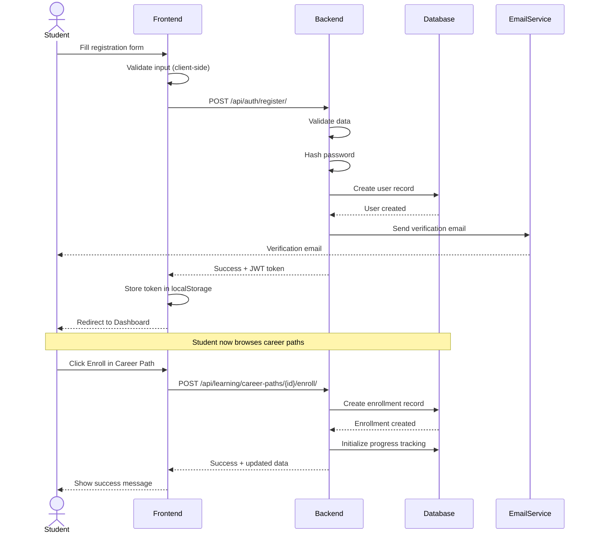
```mermaid
sequenceDiagram
    actor Student
    participant Frontend
    participant Backend
    participant Database
    participant EmailService
    
    Student->>Frontend: Fill registration form
    Frontend->>Frontend: Validate input (client-side)
    Frontend->>Backend: POST /api/auth/register/
    Backend->>Backend: Validate data
    Backend->>Backend: Hash password
    Backend->>Database: Create user record
    Database-->>Backend: User created
    Backend->>EmailService: Send verification email
    EmailService-->>Student: Verification email
    Backend-->>Frontend: Success + JWT token
    Frontend->>Frontend: Store token in localStorage
    Frontend-->>Student: Redirect to Dashboard
    
    Note over Student,Database: Student now browses career paths
    
    Student->>Frontend: Click Enroll in Career Path
    Frontend->>Backend: POST /api/learning/career-paths/{id}/enroll/
    Backend->>Database: Create enrollment record
    Database-->>Backend: Enrollment created
    Backend->>Database: Initialize progress tracking
    Backend-->>Frontend: Success + updated data
    Frontend-->>Student: Show success message
```

#### 2. AI Code Analysis Sequence

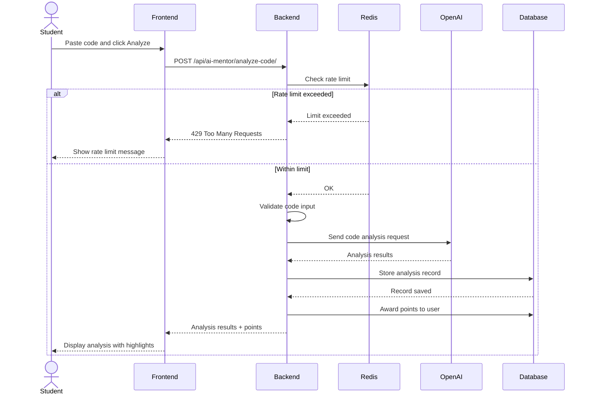
```mermaid
sequenceDiagram
    actor Student
    participant Frontend
    participant Backend
    participant Redis
    participant OpenAI
    participant Database
    
    Student->>Frontend: Paste code and click Analyze
    Frontend->>Backend: POST /api/ai-mentor/analyze-code/
    Backend->>Redis: Check rate limit
    alt Rate limit exceeded
        Redis-->>Backend: Limit exceeded
        Backend-->>Frontend: 429 Too Many Requests
        Frontend-->>Student: Show rate limit message
    else Within limit
        Redis-->>Backend: OK
        Backend->>Backend: Validate code input
        Backend->>OpenAI: Send code analysis request
        OpenAI-->>Backend: Analysis results
        Backend->>Database: Store analysis record
        Database-->>Backend: Record saved
        Backend->>Database: Award points to user
        Backend-->>Frontend: Analysis results + points
        Frontend-->>Student: Display analysis with highlights
    end
```

#### 3. Real-time Collaborative Code Editing Sequence

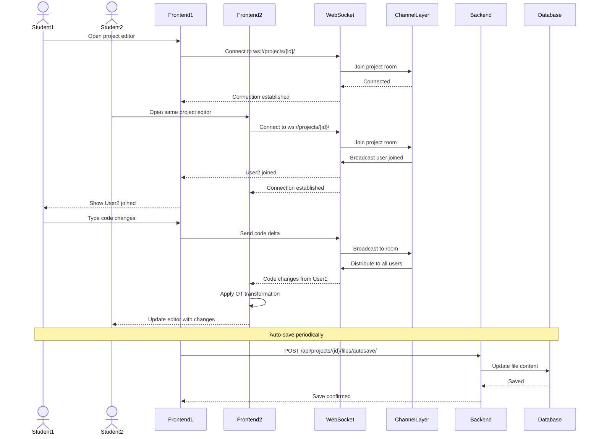
```mermaid
sequenceDiagram
    actor Student1
    actor Student2
    participant Frontend1
    participant Frontend2
    participant WebSocket
    participant ChannelLayer
    participant Backend
    participant Database
    
    Student1->>Frontend1: Open project editor
    Frontend1->>WebSocket: Connect to ws://projects/{id}/
    WebSocket->>ChannelLayer: Join project room
    ChannelLayer-->>WebSocket: Connected
    WebSocket-->>Frontend1: Connection established
    
    Student2->>Frontend2: Open same project editor
    Frontend2->>WebSocket: Connect to ws://projects/{id}/
    WebSocket->>ChannelLayer: Join project room
    ChannelLayer->>WebSocket: Broadcast user joined
    WebSocket-->>Frontend1: User2 joined
    WebSocket-->>Frontend2: Connection established
    Frontend1-->>Student1: Show User2 joined
    
    Student1->>Frontend1: Type code changes
    Frontend1->>WebSocket: Send code delta
    WebSocket->>ChannelLayer: Broadcast to room
    ChannelLayer->>WebSocket: Distribute to all users
    WebSocket-->>Frontend2: Code changes from User1
    Frontend2->>Frontend2: Apply OT transformation
    Frontend2-->>Student2: Update editor with changes
    
    Note over Student1,Database: Auto-save periodically
    
    Frontend1->>Backend: POST /api/projects/{id}/files/autosave/
    Backend->>Database: Update file content
    Database-->>Backend: Saved
    Backend-->>Frontend1: Save confirmed
```

#### 4. Quiz Taking and Grading Sequence

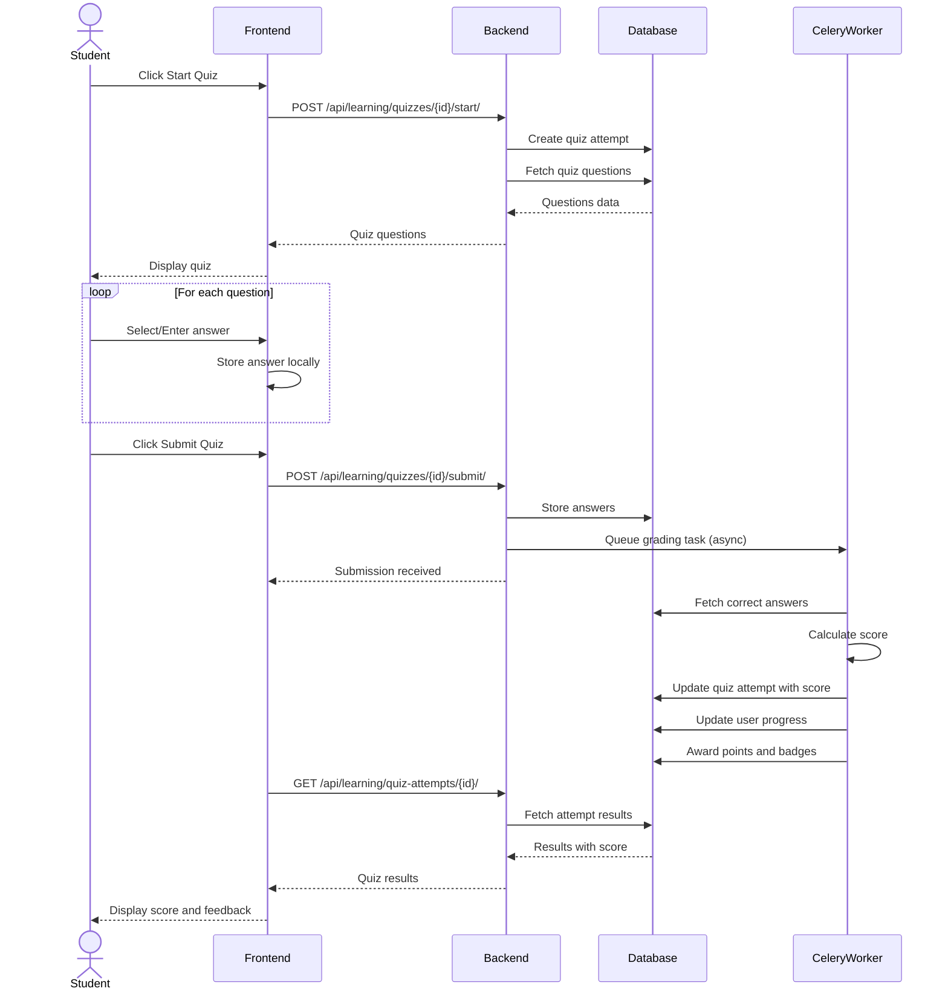
```mermaid
sequenceDiagram
    actor Student
    participant Frontend
    participant Backend
    participant Database
    participant CeleryWorker
    
    Student->>Frontend: Click Start Quiz
    Frontend->>Backend: POST /api/learning/quizzes/{id}/start/
    Backend->>Database: Create quiz attempt
    Backend->>Database: Fetch quiz questions
    Database-->>Backend: Questions data
    Backend-->>Frontend: Quiz questions
    Frontend-->>Student: Display quiz
    
    loop For each question
        Student->>Frontend: Select/Enter answer
        Frontend->>Frontend: Store answer locally
    end
    
    Student->>Frontend: Click Submit Quiz
    Frontend->>Backend: POST /api/learning/quizzes/{id}/submit/
    Backend->>Database: Store answers
    Backend->>CeleryWorker: Queue grading task (async)
    Backend-->>Frontend: Submission received
    
    CeleryWorker->>Database: Fetch correct answers
    CeleryWorker->>CeleryWorker: Calculate score
    CeleryWorker->>Database: Update quiz attempt with score
    CeleryWorker->>Database: Update user progress
    CeleryWorker->>Database: Award points and badges
    
    Frontend->>Backend: GET /api/learning/quiz-attempts/{id}/
    Backend->>Database: Fetch attempt results
    Database-->>Backend: Results with score
    Backend-->>Frontend: Quiz results
    Frontend-->>Student: Display score and feedback
```

#### 5. Code Review Request and Submission Sequence

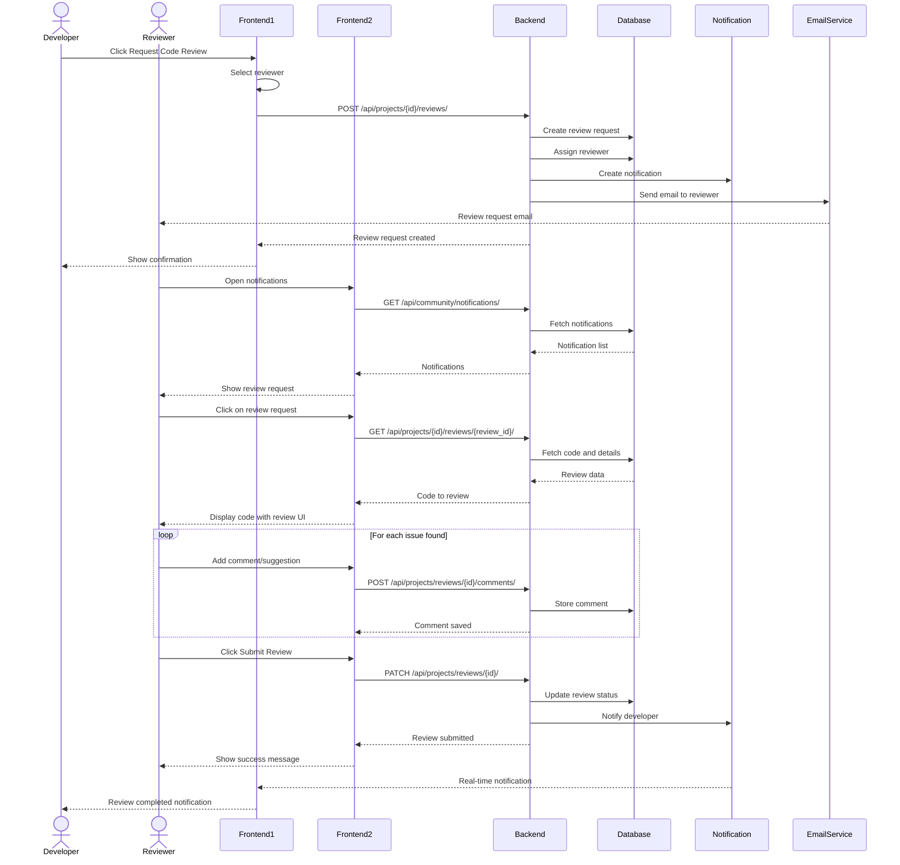
```mermaid
sequenceDiagram
    actor Developer
    actor Reviewer
    participant Frontend1
    participant Frontend2
    participant Backend
    participant Database
    participant Notification
    participant EmailService
    
    Developer->>Frontend1: Click Request Code Review
    Frontend1->>Frontend1: Select reviewer
    Frontend1->>Backend: POST /api/projects/{id}/reviews/
    Backend->>Database: Create review request
    Backend->>Database: Assign reviewer
    Backend->>Notification: Create notification
    Backend->>EmailService: Send email to reviewer
    EmailService-->>Reviewer: Review request email
    Backend-->>Frontend1: Review request created
    Frontend1-->>Developer: Show confirmation
    
    Reviewer->>Frontend2: Open notifications
    Frontend2->>Backend: GET /api/community/notifications/
    Backend->>Database: Fetch notifications
    Database-->>Backend: Notification list
    Backend-->>Frontend2: Notifications
    Frontend2-->>Reviewer: Show review request
    
    Reviewer->>Frontend2: Click on review request
    Frontend2->>Backend: GET /api/projects/{id}/reviews/{review_id}/
    Backend->>Database: Fetch code and details
    Database-->>Backend: Review data
    Backend-->>Frontend2: Code to review
    Frontend2-->>Reviewer: Display code with review UI
    
    loop For each issue found
        Reviewer->>Frontend2: Add comment/suggestion
        Frontend2->>Backend: POST /api/projects/reviews/{id}/comments/
        Backend->>Database: Store comment
        Backend-->>Frontend2: Comment saved
    end
    
    Reviewer->>Frontend2: Click Submit Review
    Frontend2->>Backend: PATCH /api/projects/reviews/{id}/
    Backend->>Database: Update review status
    Backend->>Notification: Notify developer
    Backend-->>Frontend2: Review submitted
    Frontend2-->>Reviewer: Show success message
    
    Notification-->>Frontend1: Real-time notification
    Frontend1-->>Developer: Review completed notification
```

### Activity Diagrams

#### 1. Student Learning Journey Activity Diagram

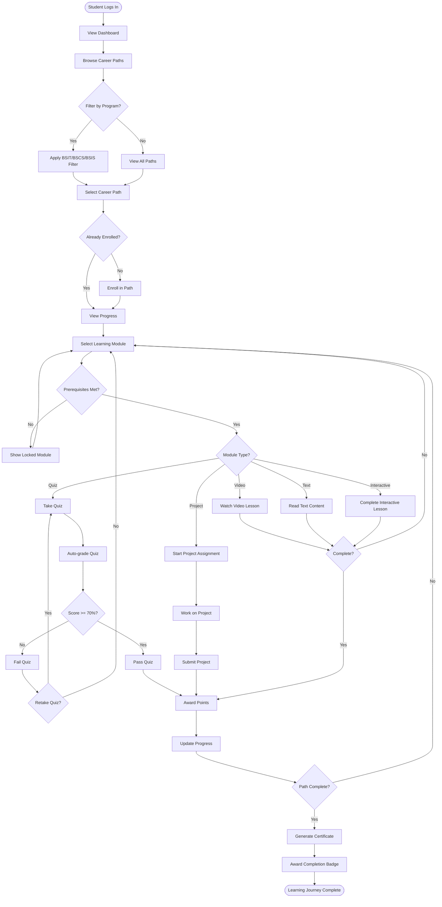
```mermaid
flowchart TD
    Start([Student Logs In]) --> Dashboard[View Dashboard]
    Dashboard --> BrowsePaths[Browse Career Paths]
    BrowsePaths --> FilterPaths{Filter by Program?}
    FilterPaths -->|Yes| ApplyFilter[Apply BSIT/BSCS/BSIS Filter]
    FilterPaths -->|No| ViewAllPaths[View All Paths]
    ApplyFilter --> SelectPath[Select Career Path]
    ViewAllPaths --> SelectPath
    
    SelectPath --> CheckEnrollment{Already Enrolled?}
    CheckEnrollment -->|No| Enroll[Enroll in Path]
    CheckEnrollment -->|Yes| ViewProgress[View Progress]
    Enroll --> ViewProgress
    
    ViewProgress --> SelectModule[Select Learning Module]
    SelectModule --> CheckPrereq{Prerequisites Met?}
    CheckPrereq -->|No| ShowLocked[Show Locked Module]
    CheckPrereq -->|Yes| ModuleType{Module Type?}
    
    ShowLocked --> SelectModule
    
    ModuleType -->|Video| WatchVideo[Watch Video Lesson]
    ModuleType -->|Text| ReadContent[Read Text Content]
    ModuleType -->|Interactive| InteractiveLesson[Complete Interactive Lesson]
    ModuleType -->|Quiz| TakeQuiz[Take Quiz]
    ModuleType -->|Project| StartProject[Start Project Assignment]
    
    WatchVideo --> MarkComplete{Complete?}
    ReadContent --> MarkComplete
    InteractiveLesson --> MarkComplete
    TakeQuiz --> AutoGrade[Auto-grade Quiz]
    AutoGrade --> CheckScore{Score >= 70%?}
    CheckScore -->|Yes| PassQuiz[Pass Quiz]
    CheckScore -->|No| FailQuiz[Fail Quiz]
    FailQuiz --> RetakeOption{Retake Quiz?}
    RetakeOption -->|Yes| TakeQuiz
    RetakeOption -->|No| SelectModule
    PassQuiz --> AwardPoints[Award Points]
    
    StartProject --> WorkOnProject[Work on Project]
    WorkOnProject --> SubmitProject[Submit Project]
    SubmitProject --> AwardPoints
    
    MarkComplete -->|Yes| AwardPoints
    MarkComplete -->|No| SelectModule
    
    AwardPoints --> UpdateProgress[Update Progress]
    UpdateProgress --> CheckPathComplete{Path Complete?}
    CheckPathComplete -->|No| SelectModule
    CheckPathComplete -->|Yes| GenerateCertificate[Generate Certificate]
    GenerateCertificate --> AwardBadge[Award Completion Badge]
    AwardBadge --> End([Learning Journey Complete])
```

#### 2. Project Collaboration Workflow Activity Diagram

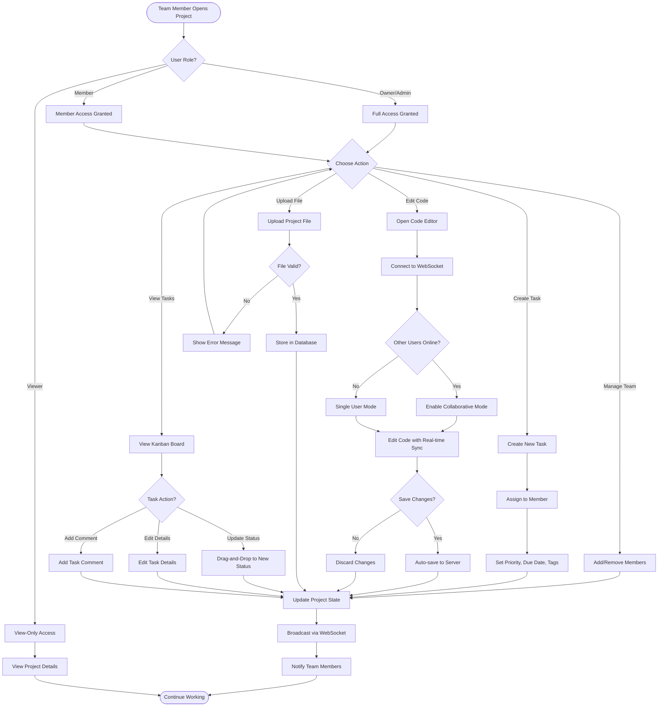
```mermaid
flowchart TD
    Start([Team Member Opens Project]) --> CheckRole{User Role?}
    CheckRole -->|Owner/Admin| FullAccess[Full Access Granted]
    CheckRole -->|Member| MemberAccess[Member Access Granted]
    CheckRole -->|Viewer| ViewAccess[View-Only Access]
    
    FullAccess --> ProjectActions{Choose Action}
    MemberAccess --> ProjectActions
    ViewAccess --> ViewProject[View Project Details]
    
    ProjectActions -->|Manage Team| TeamManagement[Add/Remove Members]
    ProjectActions -->|Create Task| CreateTask[Create New Task]
    ProjectActions -->|Edit Code| OpenEditor[Open Code Editor]
    ProjectActions -->|Upload File| UploadFile[Upload Project File]
    ProjectActions -->|View Tasks| ViewTasks[View Kanban Board]
    
    TeamManagement --> UpdateProject[Update Project State]
    CreateTask --> AssignTask[Assign to Member]
    AssignTask --> SetDetails[Set Priority, Due Date, Tags]
    SetDetails --> UpdateProject
    
    OpenEditor --> ConnectWS[Connect to WebSocket]
    ConnectWS --> CheckOtherUsers{Other Users Online?}
    CheckOtherUsers -->|Yes| CollabMode[Enable Collaborative Mode]
    CheckOtherUsers -->|No| SingleMode[Single User Mode]
    
    CollabMode --> EditCode[Edit Code with Real-time Sync]
    SingleMode --> EditCode
    EditCode --> SaveChanges{Save Changes?}
    SaveChanges -->|Yes| AutoSave[Auto-save to Server]
    SaveChanges -->|No| DiscardChanges[Discard Changes]
    AutoSave --> UpdateProject
    DiscardChanges --> UpdateProject
    
    UploadFile --> ValidateFile{File Valid?}
    ValidateFile -->|Yes| StoreFile[Store in Database]
    ValidateFile -->|No| ShowError[Show Error Message]
    StoreFile --> UpdateProject
    ShowError --> ProjectActions
    
    ViewTasks --> TaskAction{Task Action?}
    TaskAction -->|Update Status| DragDrop[Drag-and-Drop to New Status]
    TaskAction -->|Edit Details| EditTask[Edit Task Details]
    TaskAction -->|Add Comment| CommentTask[Add Task Comment]
    
    DragDrop --> UpdateProject
    EditTask --> UpdateProject
    CommentTask --> UpdateProject
    
    UpdateProject --> BroadcastChanges[Broadcast via WebSocket]
    BroadcastChanges --> NotifyMembers[Notify Team Members]
    NotifyMembers --> End([Continue Working])
    
    ViewProject --> End
```

#### 3. AI Mentor Interaction Activity Diagram

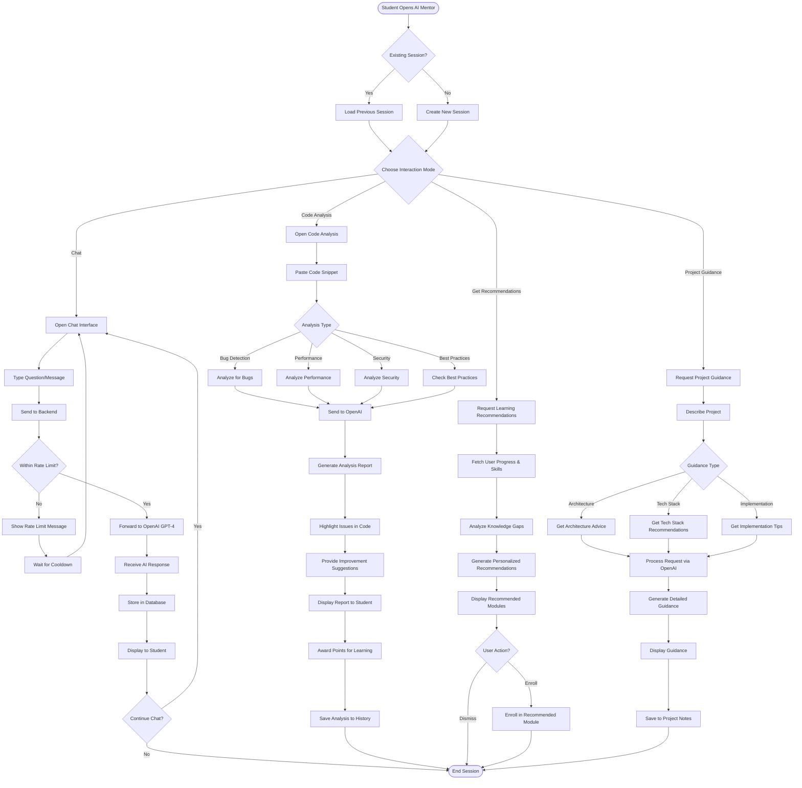
```mermaid
flowchart TD
    Start([Student Opens AI Mentor]) --> CheckSession{Existing Session?}
    CheckSession -->|Yes| LoadSession[Load Previous Session]
    CheckSession -->|No| CreateSession[Create New Session]
    
    LoadSession --> SelectMode{Choose Interaction Mode}
    CreateSession --> SelectMode
    
    SelectMode -->|Chat| ChatInterface[Open Chat Interface]
    SelectMode -->|Code Analysis| CodeAnalysis[Open Code Analysis]
    SelectMode -->|Get Recommendations| Recommendations[Request Learning Recommendations]
    SelectMode -->|Project Guidance| ProjectGuidance[Request Project Guidance]
    
    ChatInterface --> TypeMessage[Type Question/Message]
    TypeMessage --> SendMessage[Send to Backend]
    SendMessage --> CheckRateLimit{Within Rate Limit?}
    CheckRateLimit -->|No| ShowRateLimit[Show Rate Limit Message]
    CheckRateLimit -->|Yes| ForwardToOpenAI[Forward to OpenAI GPT-4]
    ShowRateLimit --> WaitCooldown[Wait for Cooldown]
    WaitCooldown --> ChatInterface
    
    ForwardToOpenAI --> ReceiveResponse[Receive AI Response]
    ReceiveResponse --> StoreMessage[Store in Database]
    StoreMessage --> DisplayResponse[Display to Student]
    DisplayResponse --> ContinueChat{Continue Chat?}
    ContinueChat -->|Yes| ChatInterface
    ContinueChat -->|No| EndSession
    
    CodeAnalysis --> PasteCode[Paste Code Snippet]
    PasteCode --> SelectAnalysisType{Analysis Type}
    SelectAnalysisType -->|Bug Detection| BugAnalysis[Analyze for Bugs]
    SelectAnalysisType -->|Performance| PerfAnalysis[Analyze Performance]
    SelectAnalysisType -->|Security| SecAnalysis[Analyze Security]
    SelectAnalysisType -->|Best Practices| BestPractices[Check Best Practices]
    
    BugAnalysis --> ProcessAnalysis[Send to OpenAI]
    PerfAnalysis --> ProcessAnalysis
    SecAnalysis --> ProcessAnalysis
    BestPractices --> ProcessAnalysis
    
    ProcessAnalysis --> GenerateReport[Generate Analysis Report]
    GenerateReport --> HighlightIssues[Highlight Issues in Code]
    HighlightIssues --> ProvideSuggestions[Provide Improvement Suggestions]
    ProvideSuggestions --> DisplayReport[Display Report to Student]
    DisplayReport --> AwardPoints[Award Points for Learning]
    AwardPoints --> SaveAnalysis[Save Analysis to History]
    SaveAnalysis --> EndSession
    
    Recommendations --> FetchUserData[Fetch User Progress & Skills]
    FetchUserData --> AnalyzeGaps[Analyze Knowledge Gaps]
    AnalyzeGaps --> GenerateRecs[Generate Personalized Recommendations]
    GenerateRecs --> DisplayRecs[Display Recommended Modules]
    DisplayRecs --> UserAction{User Action?}
    UserAction -->|Enroll| EnrollModule[Enroll in Recommended Module]
    UserAction -->|Dismiss| EndSession
    EnrollModule --> EndSession
    
    ProjectGuidance --> DescribeProject[Describe Project]
    DescribeProject --> SelectGuidanceType{Guidance Type}
    SelectGuidanceType -->|Architecture| ArchAdvice[Get Architecture Advice]
    SelectGuidanceType -->|Tech Stack| TechAdvice[Get Tech Stack Recommendations]
    SelectGuidanceType -->|Implementation| ImplAdvice[Get Implementation Tips]
    
    ArchAdvice --> ProcessGuidance[Process Request via OpenAI]
    TechAdvice --> ProcessGuidance
    ImplAdvice --> ProcessGuidance
    
    ProcessGuidance --> GenerateGuidance[Generate Detailed Guidance]
    GenerateGuidance --> DisplayGuidance[Display Guidance]
    DisplayGuidance --> SaveGuidance[Save to Project Notes]
    SaveGuidance --> EndSession
    
    EndSession([End Session])
```

#### 4. Community Post Creation and Interaction Activity Diagram

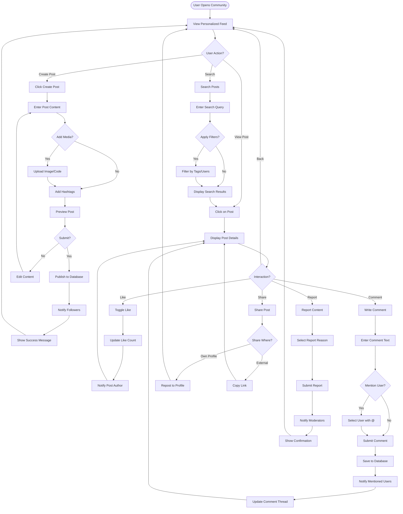
```mermaid
flowchart TD
    Start([User Opens Community]) --> ViewFeed[View Personalized Feed]
    ViewFeed --> UserAction{User Action?}
    
    UserAction -->|Create Post| CreatePost[Click Create Post]
    UserAction -->|View Post| ViewPost[Click on Post]
    UserAction -->|Search| SearchContent[Search Posts]
    
    CreatePost --> EnterContent[Enter Post Content]
    EnterContent --> AddMedia{Add Media?}
    AddMedia -->|Yes| UploadMedia[Upload Image/Code]
    AddMedia -->|No| AddTags
    UploadMedia --> AddTags[Add Hashtags]
    AddTags --> PreviewPost[Preview Post]
    PreviewPost --> SubmitPost{Submit?}
    SubmitPost -->|Yes| PublishPost[Publish to Database]
    SubmitPost -->|No| EditContent[Edit Content]
    EditContent --> EnterContent
    PublishPost --> NotifyFollowers[Notify Followers]
    NotifyFollowers --> ShowSuccess[Show Success Message]
    ShowSuccess --> ViewFeed
    
    ViewPost --> DisplayPost[Display Post Details]
    DisplayPost --> PostInteraction{Interaction?}
    PostInteraction -->|Like| LikePost[Toggle Like]
    PostInteraction -->|Comment| WriteComment[Write Comment]
    PostInteraction -->|Share| SharePost[Share Post]
    PostInteraction -->|Report| ReportPost[Report Content]
    PostInteraction -->|Back| ViewFeed
    
    LikePost --> UpdateLikes[Update Like Count]
    UpdateLikes --> NotifyAuthor[Notify Post Author]
    NotifyAuthor --> DisplayPost
    
    WriteComment --> EnterComment[Enter Comment Text]
    EnterComment --> MentionUser{Mention User?}
    MentionUser -->|Yes| SelectUser[Select User with @]
    MentionUser -->|No| SubmitComment
    SelectUser --> SubmitComment[Submit Comment]
    SubmitComment --> SaveComment[Save to Database]
    SaveComment --> NotifyMentioned[Notify Mentioned Users]
    NotifyMentioned --> UpdateThread[Update Comment Thread]
    UpdateThread --> DisplayPost
    
    SharePost --> SelectShare{Share Where?}
    SelectShare -->|Own Profile| RepostProfile[Repost to Profile]
    SelectShare -->|External| CopyLink[Copy Link]
    RepostProfile --> ViewFeed
    CopyLink --> DisplayPost
    
    ReportPost --> SelectReason[Select Report Reason]
    SelectReason --> SubmitReport[Submit Report]
    SubmitReport --> NotifyMods[Notify Moderators]
    NotifyMods --> ConfirmReport[Show Confirmation]
    ConfirmReport --> ViewFeed
    
    SearchContent --> EnterQuery[Enter Search Query]
    EnterQuery --> FilterResults{Apply Filters?}
    FilterResults -->|Yes| ApplyFilters[Filter by Tags/Users]
    FilterResults -->|No| DisplayResults[Display Search Results]
    ApplyFilters --> DisplayResults
    DisplayResults --> ViewPost
```

### Class Diagrams

#### 1. User Management and Authentication Domain

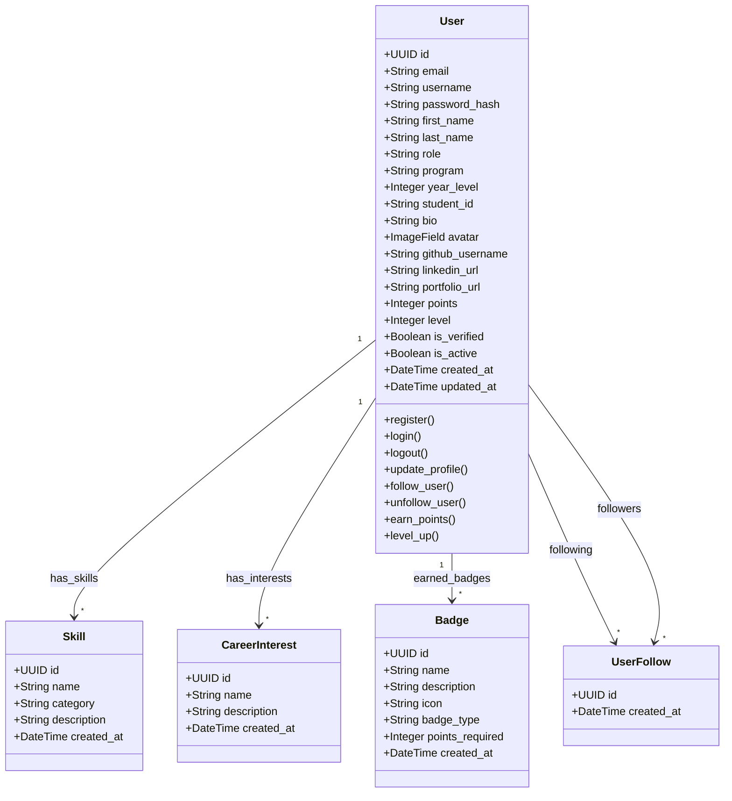
```mermaid
classDiagram
    class User {
        +UUID id
        +String email
        +String username
        +String password_hash
        +String first_name
        +String last_name
        +String role
        +String program
        +Integer year_level
        +String student_id
        +String bio
        +ImageField avatar
        +String github_username
        +String linkedin_url
        +String portfolio_url
        +Integer points
        +Integer level
        +Boolean is_verified
        +Boolean is_active
        +DateTime created_at
        +DateTime updated_at
        +register()
        +login()
        +logout()
        +update_profile()
        +follow_user()
        +unfollow_user()
        +earn_points()
        +level_up()
    }
    
    class Skill {
        +UUID id
        +String name
        +String category
        +String description
        +DateTime created_at
    }
    
    class CareerInterest {
        +UUID id
        +String name
        +String description
        +DateTime created_at
    }
    
    class Badge {
        +UUID id
        +String name
        +String description
        +String icon
        +String badge_type
        +Integer points_required
        +DateTime created_at
    }
    
    class UserFollow {
        +UUID id
        +DateTime created_at
    }
    
    User "1" --> "*" Skill : has_skills
    User "1" --> "*" CareerInterest : has_interests
    User "1" --> "*" Badge : earned_badges
    User "1" --> "*" UserFollow : following
    User "1" --> "*" UserFollow : followers
```

#### 2. Learning Management Domain

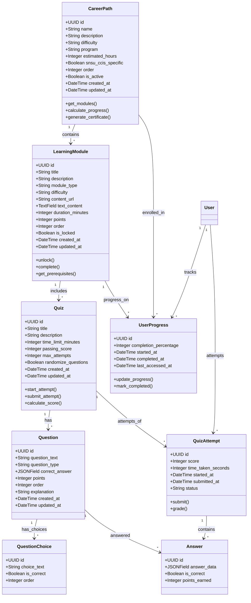
```mermaid
classDiagram
    class CareerPath {
        +UUID id
        +String name
        +String description
        +String difficulty
        +String program
        +Integer estimated_hours
        +Boolean snsu_ccis_specific
        +Integer order
        +Boolean is_active
        +DateTime created_at
        +DateTime updated_at
        +get_modules()
        +calculate_progress()
        +generate_certificate()
    }
    
    class LearningModule {
        +UUID id
        +String title
        +String description
        +String module_type
        +String difficulty
        +String content_url
        +TextField text_content
        +Integer duration_minutes
        +Integer points
        +Integer order
        +Boolean is_locked
        +DateTime created_at
        +DateTime updated_at
        +unlock()
        +complete()
        +get_prerequisites()
    }
    
    class Quiz {
        +UUID id
        +String title
        +String description
        +Integer time_limit_minutes
        +Integer passing_score
        +Integer max_attempts
        +Boolean randomize_questions
        +DateTime created_at
        +DateTime updated_at
        +start_attempt()
        +submit_attempt()
        +calculate_score()
    }
    
    class Question {
        +UUID id
        +String question_text
        +String question_type
        +JSONField correct_answer
        +Integer points
        +Integer order
        +String explanation
        +DateTime created_at
        +DateTime updated_at
    }
    
    class QuestionChoice {
        +UUID id
        +String choice_text
        +Boolean is_correct
        +Integer order
    }
    
    class UserProgress {
        +UUID id
        +Integer completion_percentage
        +DateTime started_at
        +DateTime completed_at
        +DateTime last_accessed_at
        +update_progress()
        +mark_completed()
    }
    
    class QuizAttempt {
        +UUID id
        +Integer score
        +Integer time_taken_seconds
        +DateTime started_at
        +DateTime submitted_at
        +String status
        +submit()
        +grade()
    }
    
    class Answer {
        +UUID id
        +JSONField answer_data
        +Boolean is_correct
        +Integer points_earned
    }
    
    CareerPath "1" --> "*" LearningModule : contains
    LearningModule "1" --> "*" Quiz : includes
    Quiz "1" --> "*" Question : has
    Question "1" --> "*" QuestionChoice : has_choices
    User "1" --> "*" UserProgress : tracks
    CareerPath "1" --> "*" UserProgress : enrolled_in
    LearningModule "1" --> "*" UserProgress : progress_on
    User "1" --> "*" QuizAttempt : attempts
    Quiz "1" --> "*" QuizAttempt : attempts_of
    QuizAttempt "1" --> "*" Answer : contains
    Question "1" --> "*" Answer : answered
```

#### 3. Project Collaboration Domain

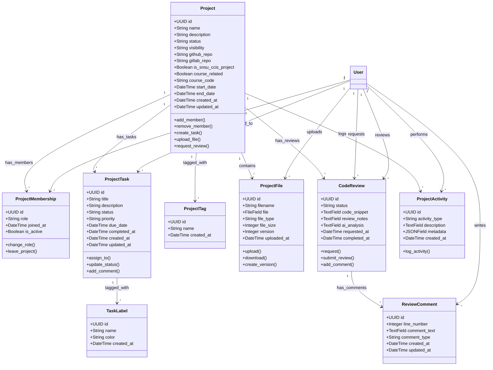
```mermaid
classDiagram
    class Project {
        +UUID id
        +String name
        +String description
        +String status
        +String visibility
        +String github_repo
        +String gitlab_repo
        +Boolean is_snsu_ccis_project
        +Boolean course_related
        +String course_code
        +DateTime start_date
        +DateTime end_date
        +DateTime created_at
        +DateTime updated_at
        +add_member()
        +remove_member()
        +create_task()
        +upload_file()
        +request_review()
    }
    
    class ProjectMembership {
        +UUID id
        +String role
        +DateTime joined_at
        +Boolean is_active
        +change_role()
        +leave_project()
    }
    
    class ProjectTask {
        +UUID id
        +String title
        +String description
        +String status
        +String priority
        +DateTime due_date
        +DateTime completed_at
        +DateTime created_at
        +DateTime updated_at
        +assign_to()
        +update_status()
        +add_comment()
    }
    
    class TaskLabel {
        +UUID id
        +String name
        +String color
        +DateTime created_at
    }
    
    class ProjectTag {
        +UUID id
        +String name
        +DateTime created_at
    }
    
    class ProjectFile {
        +UUID id
        +String filename
        +FileField file
        +String file_type
        +Integer file_size
        +Integer version
        +DateTime uploaded_at
        +upload()
        +download()
        +create_version()
    }
    
    class CodeReview {
        +UUID id
        +String status
        +TextField code_snippet
        +TextField review_notes
        +TextField ai_analysis
        +DateTime requested_at
        +DateTime completed_at
        +request()
        +submit_review()
        +add_comment()
    }
    
    class ReviewComment {
        +UUID id
        +Integer line_number
        +TextField comment_text
        +String comment_type
        +DateTime created_at
        +DateTime updated_at
    }
    
    class ProjectActivity {
        +UUID id
        +String activity_type
        +TextField description
        +JSONField metadata
        +DateTime created_at
        +log_activity()
    }
    
    Project "1" --> "*" ProjectMembership : has_members
    User "1" --> "*" ProjectMembership : participates_in
    Project "1" --> "*" ProjectTask : has_tasks
    ProjectTask "1" --> "*" TaskLabel : tagged_with
    User "1" --> "*" ProjectTask : assigned_to
    Project "1" --> "*" ProjectTag : tagged_with
    Project "1" --> "*" ProjectFile : contains
    User "1" --> "*" ProjectFile : uploads
    Project "1" --> "*" CodeReview : has_reviews
    User "1" --> "*" CodeReview : requests
    User "1" --> "*" CodeReview : reviews
    CodeReview "1" --> "*" ReviewComment : has_comments
    User "1" --> "*" ReviewComment : writes
    Project "1" --> "*" ProjectActivity : logs
    User "1" --> "*" ProjectActivity : performs
```

#### 4. Community and Social Domain

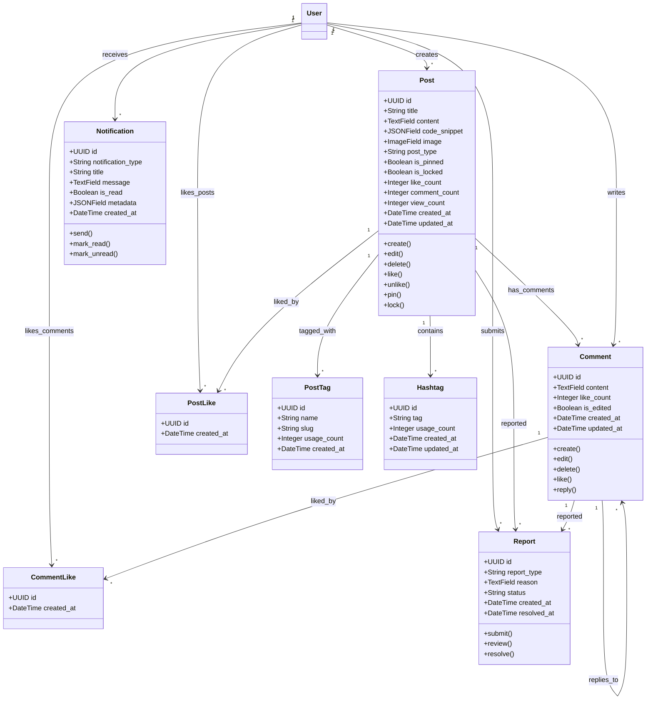
```mermaid
classDiagram
    class Post {
        +UUID id
        +String title
        +TextField content
        +JSONField code_snippet
        +ImageField image
        +String post_type
        +Boolean is_pinned
        +Boolean is_locked
        +Integer like_count
        +Integer comment_count
        +Integer view_count
        +DateTime created_at
        +DateTime updated_at
        +create()
        +edit()
        +delete()
        +like()
        +unlike()
        +pin()
        +lock()
    }
    
    class Comment {
        +UUID id
        +TextField content
        +Integer like_count
        +Boolean is_edited
        +DateTime created_at
        +DateTime updated_at
        +create()
        +edit()
        +delete()
        +like()
        +reply()
    }
    
    class PostLike {
        +UUID id
        +DateTime created_at
    }
    
    class CommentLike {
        +UUID id
        +DateTime created_at
    }
    
    class PostTag {
        +UUID id
        +String name
        +String slug
        +Integer usage_count
        +DateTime created_at
    }
    
    class Hashtag {
        +UUID id
        +String tag
        +Integer usage_count
        +DateTime created_at
        +DateTime updated_at
    }
    
    class Notification {
        +UUID id
        +String notification_type
        +String title
        +TextField message
        +Boolean is_read
        +JSONField metadata
        +DateTime created_at
        +send()
        +mark_read()
        +mark_unread()
    }
    
    class Report {
        +UUID id
        +String report_type
        +TextField reason
        +String status
        +DateTime created_at
        +DateTime resolved_at
        +submit()
        +review()
        +resolve()
    }
    
    User "1" --> "*" Post : creates
    Post "1" --> "*" Comment : has_comments
    User "1" --> "*" Comment : writes
    Comment "1" --> "*" Comment : replies_to
    User "1" --> "*" PostLike : likes_posts
    Post "1" --> "*" PostLike : liked_by
    User "1" --> "*" CommentLike : likes_comments
    Comment "1" --> "*" CommentLike : liked_by
    Post "1" --> "*" PostTag : tagged_with
    Post "1" --> "*" Hashtag : contains
    User "1" --> "*" Notification : receives
    User "1" --> "*" Report : submits
    Post "1" --> "*" Report : reported
    Comment "1" --> "*" Report : reported
```

#### 5. AI Mentor Domain

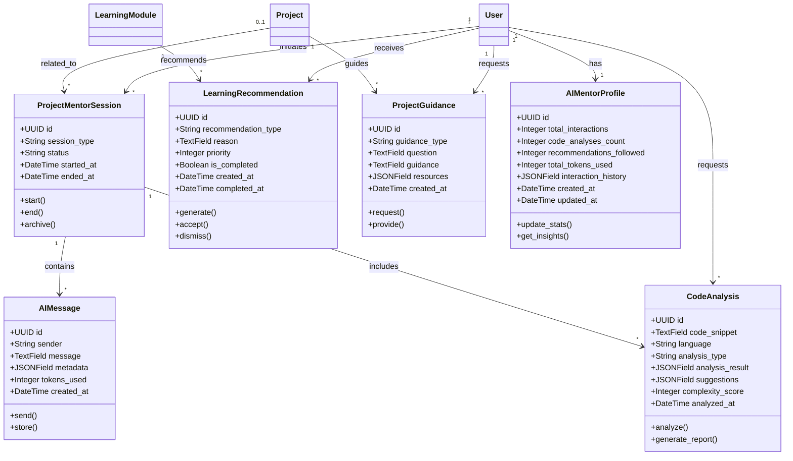
```mermaid
classDiagram
    class ProjectMentorSession {
        +UUID id
        +String session_type
        +String status
        +DateTime started_at
        +DateTime ended_at
        +start()
        +end()
        +archive()
    }
    
    class AIMessage {
        +UUID id
        +String sender
        +TextField message
        +JSONField metadata
        +Integer tokens_used
        +DateTime created_at
        +send()
        +store()
    }
    
    class CodeAnalysis {
        +UUID id
        +TextField code_snippet
        +String language
        +String analysis_type
        +JSONField analysis_result
        +JSONField suggestions
        +Integer complexity_score
        +DateTime analyzed_at
        +analyze()
        +generate_report()
    }
    
    class LearningRecommendation {
        +UUID id
        +String recommendation_type
        +TextField reason
        +Integer priority
        +Boolean is_completed
        +DateTime created_at
        +DateTime completed_at
        +generate()
        +accept()
        +dismiss()
    }
    
    class ProjectGuidance {
        +UUID id
        +String guidance_type
        +TextField question
        +TextField guidance
        +JSONField resources
        +DateTime created_at
        +request()
        +provide()
    }
    
    class AIMentorProfile {
        +UUID id
        +Integer total_interactions
        +Integer code_analyses_count
        +Integer recommendations_followed
        +Integer total_tokens_used
        +JSONField interaction_history
        +DateTime created_at
        +DateTime updated_at
        +update_stats()
        +get_insights()
    }
    
    User "1" --> "*" ProjectMentorSession : initiates
    Project "0..1" --> "*" ProjectMentorSession : related_to
    ProjectMentorSession "1" --> "*" AIMessage : contains
    User "1" --> "*" CodeAnalysis : requests
    ProjectMentorSession "1" --> "*" CodeAnalysis : includes
    User "1" --> "*" LearningRecommendation : receives
    LearningModule "1" --> "*" LearningRecommendation : recommends
    User "1" --> "*" ProjectGuidance : requests
    Project "1" --> "*" ProjectGuidance : guides
    User "1" --> "1" AIMentorProfile : has
```

## 📊 Database Schema

The platform uses a comprehensive database schema with the following main models:

- **User Management:** User, Skill, CareerInterest, Badge, UserFollow
- **Learning:** CareerPath, LearningModule, Quiz, Question, QuestionChoice, UserProgress, QuizAttempt, Answer
- **Projects:** Project, ProjectMembership, ProjectTask, TaskLabel, ProjectTag, ProjectFile, CodeReview, ReviewComment, ProjectActivity
- **Community:** Post, Comment, PostLike, CommentLike, PostTag, Hashtag, Notification, Report
- **AI Mentor:** ProjectMentorSession, AIMessage, CodeAnalysis, LearningRecommendation, ProjectGuidance, AIMentorProfile

## 🤝 Contributing

1. Fork the repository
2. Create a feature branch (`git checkout -b feature/amazing-feature`)
3. Commit your changes (`git commit -m 'Add amazing feature'`)
4. Push to the branch (`git push origin feature/amazing-feature`)
5. Open a Pull Request

## 📝 License

This project is developed for Surigao del Norte State University (SNSU) College of Computing and Information Sciences (CCIS).

## 👥 Team

Developed for SNSU CCIS students in IT, Computer Science, and Information Systems programs.

## 📧 Contact

For support or inquiries, please contact the SNSU CCIS IT Department.

---

**Note:** Remember to set your OpenAI API key in the environment variables to use the AI mentor features.

