# 🤖 AI Mentor System - Use Case Diagram

## System Overview

The AI Mentor System provides intelligent assistance through conversations, code analysis, and personalized recommendations.

---

## 📐 Use Case Diagram (Mermaid Format)

```mermaid
graph TB
    Actor_Student["👤 Student"]
    Actor_Instructor["👨‍🏫 Instructor"]
    Actor_Admin["👨‍💼 Admin"]
    
    subgraph AIMentorSystem["AI Mentor System"]
        direction TB
        
        subgraph Chat["💬 Chat & Conversation"]
            UC_StartSession["Start Chat Session"]
            UC_SendMessage["Send Message"]
            UC_ReceiveResponse["Receive AI Response"]
            UC_ViewHistory["View Chat History"]
            UC_SaveConversation["Save Conversation"]
            UC_ExportChat["Export Chat"]
            UC_ClearHistory["Clear History"]
        end
        
        subgraph CodeAssistance["💻 Code Assistance"]
            UC_AnalyzeCode["Analyze Code"]
            UC_SubmitCode["Submit Code Snippet"]
            UC_GetCodeReview["Get Code Review"]
            UC_DetectIssues["Detect Code Issues"]
            UC_SuggestImprovements["Suggest Improvements"]
            UC_ExplainCode["Explain Code Logic"]
            UC_FixBugs["Get Bug Fixes"]
        end
        
        subgraph Learning["📚 Learning Support"]
            UC_RequestExplanation["Request Explanation"]
            UC_GetConcepts["Learn Concepts"]
            UC_SolveProblem["Solve Problem Step-by-Step"]
            UC_AskQuestion["Ask Subject Question"]
            UC_GetHints["Get Hints/Tips"]
            UC_ReviewTopics["Review Module Topic"]
        end
        
        subgraph Recommendations["🎯 Recommendations"]
            UC_GetLearningPath["Get Learning Path Suggestion"]
            UC_GetModuleRecommendation["Recommend Next Module"]
            UC_IdentifyGaps["Identify Knowledge Gaps"]
            UC_SuggestResources["Suggest Resources"]
            UC_AnalyzeProgress["Analyze Learning Progress"]
            UC_GetCareerAdvice["Get Career Guidance"]
        end
        
        subgraph Configuration["⚙️ Configuration"]
            UC_SelectModel["Select AI Model"]
            UC_SetStyle["Set Response Style"]
            UC_ConfigureContext["Configure AI Context"]
            UC_SetLanguage["Set Language Preference"]
            UC_ViewSettings["View AI Settings"]
        end
        
        subgraph Administration["👨‍💼 Administration"]
            UC_MonitorUsage["Monitor AI Usage"]
            UC_ManageModels["Manage AI Models"]
            UC_ConfigureKeys["Configure API Keys"]
            UC_SetRateLimit["Set Rate Limits"]
            UC_ViewAnalytics["View Usage Analytics"]
        end
    end
    
    %% Student relationships
    Actor_Student --> UC_StartSession
    Actor_Student --> UC_SendMessage
    Actor_Student --> UC_ViewHistory
    Actor_Student --> UC_SaveConversation
    Actor_Student --> UC_ExportChat
    Actor_Student --> UC_AnalyzeCode
    Actor_Student --> UC_SubmitCode
    Actor_Student --> UC_GetCodeReview
    Actor_Student --> UC_ExplainCode
    Actor_Student --> UC_RequestExplanation
    Actor_Student --> UC_GetConcepts
    Actor_Student --> UC_SolveProblem
    Actor_Student --> UC_AskQuestion
    Actor_Student --> UC_GetHints
    Actor_Student --> UC_ReviewTopics
    Actor_Student --> UC_GetLearningPath
    Actor_Student --> UC_GetModuleRecommendation
    Actor_Student --> UC_SelectModel
    Actor_Student --> UC_SetStyle
    Actor_Student --> UC_ViewSettings
    
    %% Instructor relationships
    Actor_Instructor --> UC_StartSession
    Actor_Instructor --> UC_SendMessage
    Actor_Instructor --> UC_AnalyzeCode
    Actor_Instructor --> UC_GetCodeReview
    Actor_Instructor --> UC_AnalyzeProgress
    
    %% Admin relationships
    Actor_Admin --> UC_MonitorUsage
    Actor_Admin --> UC_ManageModels
    Actor_Admin --> UC_ConfigureKeys
    Actor_Admin --> UC_SetRateLimit
    Actor_Admin --> UC_ViewAnalytics
    
    %% Dependencies - Include relationships
    UC_StartSession -->|includes| UC_SelectModel
    UC_StartSession -->|includes| UC_ViewSettings
    UC_SendMessage -->|includes| UC_ReceiveResponse
    UC_SendMessage -->|includes| UC_ViewHistory
    UC_AnalyzeCode -->|includes| UC_SubmitCode
    UC_AnalyzeCode -->|includes| UC_DetectIssues
    UC_AnalyzeCode -->|includes| UC_SuggestImprovements
    UC_GetCodeReview -->|includes| UC_DetectIssues
    UC_GetCodeReview -->|includes| UC_SuggestImprovements
    UC_SolveProblem -->|includes| UC_GetHints
    UC_GetModuleRecommendation -->|includes| UC_AnalyzeProgress
    UC_IdentifyGaps -->|includes| UC_AnalyzeProgress
    UC_ConfigureContext -->|includes| UC_SelectModel
    
    %% Extend relationships
    UC_ReceiveResponse -->|extends| UC_SendMessage
    UC_GetLearningPath -->|extends| UC_AnalyzeProgress
    UC_SuggestResources -->|extends| UC_GetModuleRecommendation
    UC_GetCareerAdvice -->|extends| UC_AnalyzeProgress
    UC_ExplainCode -->|extends| UC_AnalyzeCode
    UC_FixBugs -->|extends| UC_DetectIssues
    UC_SaveConversation -->|extends| UC_ViewHistory
    UC_ExportChat -->|extends| UC_ViewHistory
    UC_ClearHistory -->|extends| UC_ViewHistory
    UC_SetLanguage -->|extends| UC_SetStyle
    
    style AIMentorSystem fill:#e8e8f8
    style Chat fill:#d0d0ff
    style CodeAssistance fill:#b3b3ff
    style Learning fill:#9696ff
    style Recommendations fill:#7979ff
    style Configuration fill:#ccccff
    style Administration fill:#adadff
```

---

## 📋 Use Case Descriptions

### 💬 Chat & Conversation
| Use Case | Actor | Description |
|----------|-------|-------------|
| Start Chat Session | Student | Initialize conversation with AI |
| Send Message | Student | Send question/prompt to AI |
| Receive AI Response | Student | Get AI-generated response |
| View Chat History | Student | See past conversations |
| Save Conversation | Student | Bookmark important chats |
| Export Chat | Student | Download conversation as PDF |
| Clear History | Student | Delete chat history |

### 💻 Code Assistance
| Use Case | Actor | Description |
|----------|-------|-------------|
| Analyze Code | Student | Get AI analysis of code |
| Submit Code Snippet | Student | Paste code for review |
| Get Code Review | Student/Instructor | Receive detailed code review |
| Detect Code Issues | AI | Identify bugs and problems |
| Suggest Improvements | AI | Recommend optimizations |
| Explain Code Logic | AI | Explain what code does |
| Get Bug Fixes | Student | Receive bug fix suggestions |

### 📚 Learning Support
| Use Case | Actor | Description |
|----------|-------|-------------|
| Request Explanation | Student | Ask AI to explain concept |
| Learn Concepts | Student | Get educational explanation |
| Solve Problem Step-by-Step | Student | Get step-by-step solution |
| Ask Subject Question | Student | Ask domain-specific question |
| Get Hints/Tips | Student | Receive helpful hints |
| Review Module Topic | Student | Get summary of module content |

### 🎯 Recommendations
| Use Case | Actor | Description |
|----------|-------|-------------|
| Get Learning Path Suggestion | Student | AI recommends learning path |
| Recommend Next Module | Student | AI suggests next module to take |
| Identify Knowledge Gaps | Student | AI finds gaps in knowledge |
| Suggest Resources | Student | AI recommends learning materials |
| Analyze Learning Progress | Student/Instructor | Get progress analysis |
| Get Career Guidance | Student | Receive career advice |

### ⚙️ Configuration
| Use Case | Actor | Description |
|----------|-------|-------------|
| Select AI Model | Student | Choose AI model (Gemini/GPT-4/Claude) |
| Set Response Style | Student | Choose formal/casual/technical |
| Configure AI Context | Student | Set learning context |
| Set Language Preference | Student | Choose response language |
| View AI Settings | Student | See current configuration |

### 👨‍💼 Administration
| Use Case | Actor | Description |
|----------|-------|-------------|
| Monitor AI Usage | Admin | Track usage statistics |
| Manage AI Models | Admin | Add/remove AI models |
| Configure API Keys | Admin | Set up API credentials |
| Set Rate Limits | Admin | Control usage quotas |
| View Usage Analytics | Admin | See detailed analytics |

---

## 🔄 Key Workflows

### Chat Session Flow
