# 📊 Dashboard System - Use Case Diagram

## System Overview

The Dashboard is the central hub where users access role-specific information and analytics.

---

## 📐 Use Case Diagram (Mermaid Format)

```mermaid
graph TB
    Actor_Student["👤 Student"]
    Actor_Instructor["👨‍🏫 Instructor"]
    Actor_Admin["👨‍💼 Admin"]
    
    subgraph DashboardSystem["Dashboard System"]
        direction TB
        
        subgraph AccessControl["🔐 Access Control"]
            UC_AuthenticateUser["Authenticate User"]
            UC_VerifyRole["Verify User Role"]
            UC_LoadDashboard["Load Dashboard"]
        end
        
        subgraph StudentDashboard["👤 Student Dashboard"]
            UC_ViewStudentStats["View Personal Statistics"]
            UC_ViewEnrollments["View My Enrollments"]
            UC_ViewProgress["View Learning Progress"]
            UC_ViewRecentActivity["View Recent Activity"]
            UC_AccessQuickLinks["Access Quick Links"]
            UC_ViewRecommendations["View Recommendations"]
            UC_ViewAchievements["View Achievements/Badges"]
            UC_ViewStreaks["View Learning Streaks"]
        end
        
        subgraph InstructorDashboard["👨‍🏫 Instructor Dashboard"]
            UC_ViewTeachingStats["View Teaching Statistics"]
            UC_ViewEnrolledStudents["View Enrolled Students"]
            UC_ViewStudentProgress["View Student Progress"]
            UC_ViewAssignments["View Assignments/Tasks"]
            UC_ViewGradingQueue["View Grading Queue"]
            UC_AccessAnalytics["Access Teaching Analytics"]
            UC_ViewCourseMetrics["View Course Metrics"]
            UC_ViewCommunityModeration["View Posts Needing Moderation"]
        end
        
        subgraph AdminDashboard["👨‍💼 Admin Dashboard"]
            UC_ViewSystemStats["View System Statistics"]
            UC_ViewUserMetrics["View User Metrics"]
            UC_ViewActiveUsers["View Active Users"]
            UC_MonitorSystemHealth["Monitor System Health"]
            UC_ViewErrorAlerts["View Error Alerts"]
            UC_ViewServerStatus["View Server Status"]
            UC_AccessAdminTools["Access Admin Tools"]
            UC_ViewSystemAlerts["View System-wide Alerts"]
        end
        
        subgraph PersonalInfo["👤 Personal Information"]
            UC_ViewProfile["View Profile Info"]
            UC_EditProfile["Edit Profile"]
            UC_ViewPreferences["View User Preferences"]
            UC_UpdateSettings["Update Dashboard Settings"]
            UC_ChangeNotificationPrefs["Change Notification Preferences"]
        end
        
        subgraph QuickActions["⚡ Quick Actions"]
            UC_StartNewLesson["Start New Lesson"]
            UC_CreatePost["Create Community Post"]
            UC_StartProject["Start New Project"]
            UC_SendMessage["Send Message/Chat"]
            UC_ViewNotifications["View Notifications"]
            UC_AccessAIMentor["Access AI Mentor"]
        end
        
        subgraph Analytics["📈 Analytics & Reports"]
            UC_ViewCharts["View Performance Charts"]
            UC_GenerateReport["Generate Report"]
            UC_ExportData["Export Dashboard Data"]
            UC_ViewTrends["View Trends Over Time"]
            UC_CompareMetrics["Compare Performance Metrics"]
        end
    end
    
    %% Student relationships
    Actor_Student --> UC_AuthenticateUser
    UC_AuthenticateUser -->|includes| UC_VerifyRole
    UC_VerifyRole -->|includes| UC_LoadDashboard
    UC_LoadDashboard --> UC_ViewStudentStats
    UC_LoadDashboard --> UC_ViewEnrollments
    UC_LoadDashboard --> UC_ViewProgress
    UC_LoadDashboard --> UC_ViewRecentActivity
    UC_LoadDashboard --> UC_ViewRecommendations
    UC_LoadDashboard --> UC_AccessQuickLinks
    
    Actor_Student --> UC_ViewProfile
    Actor_Student --> UC_EditProfile
    Actor_Student --> UC_ViewPreferences
    Actor_Student --> UC_UpdateSettings
    
    Actor_Student --> UC_StartNewLesson
    Actor_Student --> UC_CreatePost
    Actor_Student --> UC_StartProject
    Actor_Student --> UC_ViewNotifications
    Actor_Student --> UC_AccessAIMentor
    
    Actor_Student --> UC_ViewAchievements
    Actor_Student --> UC_ViewStreaks
    
    %% Instructor relationships
    Actor_Instructor --> UC_AuthenticateUser
    UC_AuthenticateUser -->|includes| UC_VerifyRole
    UC_VerifyRole -->|includes| UC_LoadDashboard
    UC_LoadDashboard --> UC_ViewTeachingStats
    UC_LoadDashboard --> UC_ViewEnrolledStudents
    UC_LoadDashboard --> UC_ViewStudentProgress
    UC_LoadDashboard --> UC_ViewAssignments
    UC_LoadDashboard --> UC_ViewGradingQueue
    UC_LoadDashboard --> UC_AccessAnalytics
    UC_LoadDashboard --> UC_ViewCourseMetrics
    UC_LoadDashboard --> UC_ViewCommunityModeration
    
    Actor_Instructor --> UC_ViewProfile
    Actor_Instructor --> UC_EditProfile
    
    Actor_Instructor --> UC_CreatePost
    Actor_Instructor --> UC_ViewNotifications
    
    %% Admin relationships
    Actor_Admin --> UC_AuthenticateUser
    UC_AuthenticateUser -->|includes| UC_VerifyRole
    UC_VerifyRole -->|includes| UC_LoadDashboard
    UC_LoadDashboard --> UC_ViewSystemStats
    UC_LoadDashboard --> UC_ViewUserMetrics
    UC_LoadDashboard --> UC_ViewActiveUsers
    UC_LoadDashboard --> UC_MonitorSystemHealth
    UC_LoadDashboard --> UC_ViewErrorAlerts
    UC_LoadDashboard --> UC_ViewServerStatus
    UC_LoadDashboard --> UC_AccessAdminTools
    UC_LoadDashboard --> UC_ViewSystemAlerts
    
    Actor_Admin --> UC_ViewProfile
    Actor_Admin --> UC_ViewNotifications
    
    %% Analytics relationships
    UC_ViewStudentStats -->|includes| UC_ViewCharts
    UC_ViewTeachingStats -->|includes| UC_ViewCharts
    UC_ViewSystemStats -->|includes| UC_ViewCharts
    
    UC_ViewProgress -->|extends| UC_ViewTrends
    UC_AccessAnalytics -->|extends| UC_GenerateReport
    UC_GenerateReport -->|includes| UC_ExportData
    
    %% Notification relationships
    UC_ViewRecentActivity -->|extends| UC_ViewNotifications
    UC_ChangeNotificationPrefs -->|extends| UC_UpdateSettings
    
    style DashboardSystem fill:#f5f5f5
    style AccessControl fill:#e3f2fd
    style StudentDashboard fill:#e8f5e9
    style InstructorDashboard fill:#fff3e0
    style AdminDashboard fill:#fce4ec
    style PersonalInfo fill:#f3e5f5
    style QuickActions fill:#ede7f6
    style Analytics fill:#e0f2f1
```

---

## 📋 Use Case Descriptions

### 🔐 Access Control
| Use Case | Actor | Description |
|----------|-------|-------------|
| Authenticate User | All | Verify user credentials (login) |
| Verify User Role | System | Check user role and permissions |
| Load Dashboard | System | Display role-appropriate dashboard |

### 👤 Student Dashboard
| Use Case | Actor | Description |
|----------|-------|-------------|
| View Personal Statistics | Student | See points, level, streaks, progress |
| View My Enrollments | Student | List of enrolled career paths |
| View Learning Progress | Student | Completion % and modules completed |
| View Recent Activity | Student | Recent posts, projects, activities |
| Access Quick Links | Student | Shortcuts to common features |
| View Recommendations | Student | AI-suggested next steps |
| View Achievements/Badges | Student | Earned badges and certifications |
| View Learning Streaks | Student | Consecutive learning days count |

### 👨‍🏫 Instructor Dashboard
| Use Case | Actor | Description |
|----------|-------|-------------|
| View Teaching Statistics | Instructor | Student count, course metrics |
| View Enrolled Students | Instructor | List of students in courses |
| View Student Progress | Instructor | Track student completion rates |
| View Assignments/Tasks | Instructor | Pending assignments to grade |
| View Grading Queue | Instructor | Ungraded quizzes and submissions |
| Access Teaching Analytics | Instructor | Course performance analytics |
| View Course Metrics | Instructor | Engagement, completion, dropout rates |
| View Posts Needing Moderation | Instructor | Community posts awaiting review |

### 👨‍💼 Admin Dashboard
| Use Case | Actor | Description |
|----------|-------|-------------|
| View System Statistics | Admin | Total users, courses, posts, etc. |
| View User Metrics | Admin | Active users, signups, churn |
| View Active Users | Admin | Currently online users |
| Monitor System Health | Admin | CPU, memory, database status |
| View Error Alerts | Admin | System errors and warnings |
| View Server Status | Admin | Server uptime, response times |
| Access Admin Tools | Admin | User management, content moderation |
| View System-wide Alerts | Admin | Critical system notifications |

### 👤 Personal Information
| Use Case | Actor | Description |
|----------|-------|-------------|
| View Profile Info | All | See personal profile information |
| Edit Profile | All | Update name, bio, contact info |
| View User Preferences | All | See saved preferences |
| Update Dashboard Settings | All | Customize dashboard layout/widgets |
| Change Notification Preferences | All | Control notification types/frequency |

### ⚡ Quick Actions
| Use Case | Actor | Description |
|----------|-------|-------------|
| Start New Lesson | Student | Quick access to begin learning |
| Create Community Post | Student | Quick post creation |
| Start New Project | Student | Quick project creation |
| Send Message/Chat | All | Quick access to messaging |
| View Notifications | All | See latest notifications |
| Access AI Mentor | Student | Quick access to AI chat |

### 📈 Analytics & Reports
| Use Case | Actor | Description |
|----------|-------|-------------|
| View Performance Charts | Student/Instructor | Visualize performance data |
| Generate Report | Instructor/Admin | Create custom report |
| Export Dashboard Data | Instructor/Admin | Download data as CSV/PDF |
| View Trends Over Time | Instructor/Admin | See historical trends |
| Compare Performance Metrics | Instructor/Admin | Compare metrics across periods |

---

## 🔄 Key Workflows

### Student Dashboard Flow

