# 📊 Main System - Use Case Diagram

## System Overview

CCIS-CodeHub is an AI-driven learning platform with role-based access for Students, Instructors, and Admins.

---

## 📐 Use Case Diagram (Mermaid Format)

```mermaid
graph TB
    Actor_Student["👤 Student"]
    Actor_Instructor["👨‍🏫 Instructor"]
    Actor_Admin["👨‍💼 Admin"]
    
    subgraph System["CCIS-CodeHub System"]
        direction TB
        
        subgraph Auth["🔐 Authentication"]
            UC_Register["Register Account"]
            UC_Login["Login"]
            UC_Logout["Logout"]
            UC_ForgotPassword["Reset Password"]
        end
        
        subgraph Dashboard["📊 Dashboard"]
            UC_ViewDashboard["View Dashboard"]
            UC_ViewStats["View Statistics"]
            UC_ViewAnalytics["View Analytics"]
        end
        
        subgraph Learning["📚 Learning Management"]
            UC_BrowsePaths["Browse Career Paths"]
            UC_EnrollPath["Enroll in Path"]
            UC_CompleteModule["Complete Module"]
            UC_TakeQuiz["Take Quiz"]
            UC_ViewCertificate["View Certificate"]
            UC_CreatePath["Create Career Path"]
            UC_CreateModule["Create Module"]
            UC_CreateQuiz["Create Quiz"]
            UC_GradeQuiz["Grade Quiz"]
            UC_ViewProgress["View Student Progress"]
        end
        
        subgraph Projects["🚀 Project Management"]
            UC_CreateProject["Create Project"]
            UC_ManageTasks["Manage Tasks"]
            UC_ShareFiles["Share Files"]
            UC_RequestReview["Request Code Review"]
            UC_ProvideReview["Provide Code Review"]
            UC_InviteMembers["Invite Team Members"]
        end
        
        subgraph Community["💬 Community"]
            UC_CreatePost["Create Post"]
            UC_CommentPost["Comment on Post"]
            UC_LikePost["Like Post"]
            UC_FollowUser["Follow User"]
            UC_JoinStudyGroup["Join Study Group"]
            UC_SearchContent["Search Content"]
        end
        
        subgraph AIMentor["🤖 AI Mentor"]
            UC_ChatAI["Chat with AI"]
            UC_AnalyzeCode["Analyze Code"]
            UC_GetRecommendations["Get Recommendations"]
            UC_ConfigureAI["Configure AI Settings"]
        end
        
        subgraph Admin_Manage["⚙️ Administration"]
            UC_ManageUsers["Manage Users"]
            UC_ViewSystemHealth["View System Health"]
            UC_ManageContent["Moderate Content"]
            UC_AssignRoles["Assign User Roles"]
            UC_GenerateReports["Generate Reports"]
        end
    end
    
    %% Student relationships
    Actor_Student --> UC_Register
    Actor_Student --> UC_Login
    Actor_Student --> UC_ViewDashboard
    Actor_Student --> UC_BrowsePaths
    Actor_Student --> UC_EnrollPath
    Actor_Student --> UC_CompleteModule
    Actor_Student --> UC_TakeQuiz
    Actor_Student --> UC_ViewCertificate
    Actor_Student --> UC_CreateProject
    Actor_Student --> UC_ManageTasks
    Actor_Student --> UC_CreatePost
    Actor_Student --> UC_CommentPost
    Actor_Student --> UC_LikePost
    Actor_Student --> UC_FollowUser
    Actor_Student --> UC_JoinStudyGroup
    Actor_Student --> UC_ChatAI
    Actor_Student --> UC_AnalyzeCode
    Actor_Student --> UC_GetRecommendations
    
    %% Instructor relationships (extends Student)
    Actor_Instructor --> UC_Login
    Actor_Instructor --> UC_ViewDashboard
    Actor_Instructor --> UC_ViewProgress
    Actor_Instructor --> UC_CreatePath
    Actor_Instructor --> UC_CreateModule
    Actor_Instructor --> UC_CreateQuiz
    Actor_Instructor --> UC_GradeQuiz
    Actor_Instructor --> UC_ProvideReview
    Actor_Instructor --> UC_SearchContent
    
    %% Admin relationships
    Actor_Admin --> UC_Login
    Actor_Admin --> UC_ViewDashboard
    Actor_Admin --> UC_ManageUsers
    Actor_Admin --> UC_ViewSystemHealth
    Actor_Admin --> UC_ManageContent
    Actor_Admin --> UC_AssignRoles
    Actor_Admin --> UC_GenerateReports
    
    %% Dependencies (includes)
    UC_EnrollPath -->|includes| UC_BrowsePaths
    UC_CompleteModule -->|includes| UC_ViewProgress
    UC_TakeQuiz -->|includes| UC_ViewProgress
    UC_CreateProject -->|includes| UC_InviteMembers
    UC_ManageTasks -->|includes| UC_ShareFiles
    UC_ChatAI -->|includes| UC_ConfigureAI
    
    style System fill:#f0f0f0
    style Auth fill:#e8f4f8
    style Dashboard fill:#f0e8f8
    style Learning fill:#e8f8e8
    style Projects fill:#f8f0e8
    style Community fill:#f8e8e8
    style AIMentor fill:#e8e8f8
    style Admin_Manage fill:#f8e8f0
```

---

## 📋 Actor Descriptions

### 👤 **Student**
- Enrolls in career paths
- Completes learning modules
- Takes quizzes
- Participates in community
- Creates and collaborates on projects
- Uses AI mentor for assistance

### 👨‍🏫 **Instructor**
- Creates and manages career paths
- Creates and grades quizzes
- Views student progress
- Reviews student code
- Provides feedback
- Accesses teaching analytics

### 👨‍💼 **Admin**
- Manages all users and roles
- Monitors system health
- Moderates content
- Generates system reports
- Manages platform settings

---

## 📝 Primary Use Cases by Role

### Student (15 use cases)
1. Register Account
2. Login / Logout
3. View Dashboard
4. Browse Career Paths
5. Enroll in Path
6. Complete Module
7. Take Quiz
8. View Certificate
9. Create Project
10. Manage Tasks
11. Create Post
12. Comment / Like Posts
13. Follow User
14. Chat with AI
15. Analyze Code

### Instructor (8 use cases)
1. Login / View Dashboard
2. Create Career Path
3. Create Module
4. Create Quiz
5. Grade Quiz
6. View Student Progress
7. Provide Code Review
8. View Analytics

### Admin (7 use cases)
1. Login / View Dashboard
2. Manage Users
3. Assign User Roles
4. View System Health
5. Moderate Content
6. Generate Reports
7. System Administration

