# 🚀 Project Management System - Use Case Diagram

## System Overview

The Project Management System enables students to collaborate on team projects with task management, file sharing, and code review capabilities.

---

## 📐 Use Case Diagram (Mermaid Format)

```mermaid
graph TB
    Actor_Student["👤 Student"]
    Actor_Instructor["👨‍🏫 Instructor"]
    Actor_Admin["👨‍💼 Admin"]
    
    subgraph ProjectSystem["Project Management System"]
        direction TB
        
        subgraph ProjectSetup["🎯 Project Setup"]
            UC_CreateProject["Create Project"]
            UC_SetProjectDetails["Set Project Details"]
            UC_SelectTechStack["Select Tech Stack"]
            UC_EditProject["Edit Project"]
            UC_PublishProject["Publish Project"]
            UC_ArchiveProject["Archive Project"]
        end
        
        subgraph TeamManagement["👥 Team Management"]
            UC_InviteMembers["Invite Team Members"]
            UC_AssignRoles["Assign Team Roles"]
            UC_ViewTeam["View Team Members"]
            UC_RemoveMember["Remove Team Member"]
            UC_SetPermissions["Set Permissions"]
        end
        
        subgraph TaskManagement["📋 Task Management"]
            UC_CreateTask["Create Task"]
            UC_AssignTask["Assign Task"]
            UC_UpdateTaskStatus["Update Task Status"]
            UC_SetPriority["Set Priority Level"]
            UC_SetDeadline["Set Deadline"]
            UC_ViewTasks["View Kanban Board"]
            UC_FilterTasks["Filter/Sort Tasks"]
            UC_CompleteTask["Complete Task"]
        end
        
        subgraph FileManagement["📁 File Management"]
            UC_UploadFile["Upload Project File"]
            UC_ShareFile["Share File"]
            UC_DownloadFile["Download File"]
            UC_ViewFileHistory["View File History"]
            UC_DeleteFile["Delete File"]
            UC_CommentOnFile["Comment on File"]
        end
        
        subgraph CodeReview["👀 Code Review"]
            UC_RequestReview["Request Code Review"]
            UC_ProvideReview["Provide Code Review"]
            UC_CommentCode["Comment on Code"]
            UC_ApproveCode["Approve Code Changes"]
            UC_RequestChanges["Request Changes"]
            UC_ReviewHistory["View Review History"]
        end
        
        subgraph Collaboration["💬 Collaboration"]
            UC_CreateComment["Create Project Comment"]
            UC_UpdateMilestone["Update Milestone"]
            UC_TrackActivity["Track Project Activity"]
            UC_ShareLink["Share Project Link"]
            UC_LinkGitHub["Link GitHub Repository"]
        end
    end
    
    %% Student relationships
    Actor_Student --> UC_CreateProject
    Actor_Student --> UC_SetProjectDetails
    Actor_Student --> UC_SelectTechStack
    Actor_Student --> UC_EditProject
    Actor_Student --> UC_PublishProject
    Actor_Student --> UC_InviteMembers
    Actor_Student --> UC_AssignRoles
    Actor_Student --> UC_ViewTeam
    Actor_Student --> UC_CreateTask
    Actor_Student --> UC_AssignTask
    Actor_Student --> UC_UpdateTaskStatus
    Actor_Student --> UC_ViewTasks
    Actor_Student --> UC_CompleteTask
    Actor_Student --> UC_UploadFile
    Actor_Student --> UC_ShareFile
    Actor_Student --> UC_DownloadFile
    Actor_Student --> UC_RequestReview
    Actor_Student --> UC_ProvideReview
    Actor_Student --> UC_CommentCode
    Actor_Student --> UC_CreateComment
    Actor_Student --> UC_UpdateMilestone
    Actor_Student --> UC_LinkGitHub
    
    %% Instructor relationships
    Actor_Instructor --> UC_ViewTeam
    Actor_Instructor --> UC_ProvideReview
    Actor_Instructor --> UC_ApproveCode
    Actor_Instructor --> UC_ViewTasks
    Actor_Instructor --> UC_TrackActivity
    Actor_Instructor --> UC_ReviewHistory
    
    %% Admin relationships
    Actor_Admin --> UC_ArchiveProject
    Actor_Admin --> UC_ViewTeam
    Actor_Admin --> UC_TrackActivity
    
    %% Dependencies - Include relationships
    UC_CreateProject -->|includes| UC_SetProjectDetails
    UC_CreateProject -->|includes| UC_SelectTechStack
    UC_CreateProject -->|includes| UC_InviteMembers
    UC_InviteMembers -->|includes| UC_AssignRoles
    UC_InviteMembers -->|includes| UC_SetPermissions
    UC_AssignTask -->|includes| UC_SetPriority
    UC_AssignTask -->|includes| UC_SetDeadline
    UC_RequestReview -->|includes| UC_CommentCode
    UC_ProvideReview -->|includes| UC_CommentCode
    UC_ProvideReview -->|includes| UC_ApproveCode
    UC_UpdateTaskStatus -->|includes| UC_TrackActivity
    UC_UploadFile -->|includes| UC_ViewFileHistory
    
    %% Extend relationships
    UC_ShareFile -->|extends| UC_UploadFile
    UC_CommentOnFile -->|extends| UC_UploadFile
    UC_RequestChanges -->|extends| UC_ProvideReview
    UC_ReviewHistory -->|extends| UC_ProvideReview
    UC_ApproveCode -->|extends| UC_ProvideReview
    UC_LinkGitHub -->|extends| UC_CreateProject
    
    style ProjectSystem fill:#f8f0e8
    style ProjectSetup fill:#ffe0b2
    style TeamManagement fill:#ffcc80
    style TaskManagement fill:#ffb74d
    style FileManagement fill:#ffa726
    style CodeReview fill:#ff9800
    style Collaboration fill:#fb8c00
```

---

## 📋 Use Case Descriptions

### 🎯 Project Setup
| Use Case | Actor | Description |
|----------|-------|-------------|
| Create Project | Student | Initialize a new project |
| Set Project Details | Student | Add name, description, goals |
| Select Tech Stack | Student | Choose technologies (React, Django, etc.) |
| Edit Project | Student/Instructor | Modify project information |
| Publish Project | Student | Make project public/visible |
| Archive Project | Admin | Move completed project to archive |

### 👥 Team Management
| Use Case | Actor | Description |
|----------|-------|-------------|
| Invite Team Members | Student | Send invitations to join |
| Assign Team Roles | Student | Designate owner, developer, reviewer roles |
| View Team Members | All | See project team composition |
| Remove Team Member | Student | Remove member from project |
| Set Permissions | Student | Control what members can do |

### 📋 Task Management
| Use Case | Actor | Description |
|----------|-------|-------------|
| Create Task | Student | Add new project task |
| Assign Task | Student | Assign task to team member |
| Update Task Status | Student | Change status (To-Do → In Progress → Done) |
| Set Priority Level | Student | Mark as Low/Medium/High/Critical |
| Set Deadline | Student | Add due date to task |
| View Kanban Board | Student/Instructor | See all tasks in columns |
| Filter/Sort Tasks | Student | Organize tasks by priority, assignee |
| Complete Task | Student | Mark task as done |

### 📁 File Management
| Use Case | Actor | Description |
|----------|-------|-------------|
| Upload Project File | Student | Add code/documentation files |
| Share File | Student | Make file accessible to team |
| Download File | Student | Get local copy of file |
| View File History | Student | See file versions/changes |
| Delete File | Student | Remove file from project |
| Comment on File | Student | Add notes to specific files |

### 👀 Code Review
| Use Case | Actor | Description |
|----------|-------|-------------|
| Request Code Review | Student | Ask for peer review |
| Provide Code Review | Student/Instructor | Review and comment on code |
| Comment on Code | Student | Add line-by-line comments |
| Approve Code Changes | Instructor | Accept reviewed code |
| Request Changes | Student/Instructor | Ask for modifications |
| View Review History | Student | See past code reviews |

### 💬 Collaboration
| Use Case | Actor | Description |
|----------|-------|-------------|
| Create Project Comment | Student | Add general project comments |
| Update Milestone | Student | Track project milestones |
| Track Project Activity | Student/Instructor | See activity feed/log |
| Share Project Link | Student | Share project with others |
| Link GitHub Repository | Student | Connect GitHub repo to project |

---

## 🔄 Key Workflows

### Project Creation Flow
