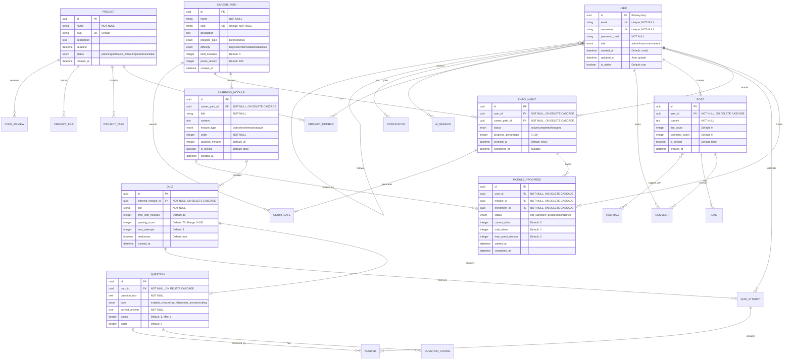

# Additional UML Diagrams - CCIS-CodeHub

## Additional Sequence Diagrams

### 1. User Authentication Flow


### 2. Quiz Taking Flow


### 3. Project Collaboration Flow


### 4. Content Upload and Processing Flow


---

## Detailed Module Diagrams

### Learning Module - Detailed Class Diagram


### AI Mentor Module - Detailed Architecture

```mermaid
graph TB
    subgraph Client["Client Interface"]
        ChatUI[Chat UI Component]
        CodeEditor[Code Editor]
        ContextPanel[Learning Context Panel]
    end
    
    subgraph API_Layer["API Layer"]
        ChatEndpoint[/api/ai-mentor/chat]
        CodeAnalysisEndpoint[/api/ai-mentor/analyze-code]
        RecommendationEndpoint[/api/ai-mentor/recommendations]
        HistoryEndpoint[/api/ai-mentor/history]
    end
    
    subgraph AI_Service["AI Mentor Service"]
        MessageProcessor[Message Processor]
        ContextBuilder[Context Builder]
        ModelSelector[AI Model Selector]
        ResponseFormatter[Response Formatter]
    end
    
    subgraph AI_Providers["AI Provider Integration"]
        OpenAI[OpenAI GPT-4]
        Gemini[Google Gemini]
        ProviderRouter[Provider Router]
    end
    
    subgraph Context_Sources["Context Sources"]
        UserProfile[User Profile & Progress]
        CurrentModule[Current Learning Module]
        PreviousConversations[Conversation History]
        CodeSubmissions[Code Submissions]
    end
    
    subgraph Storage["Storage Layer"]
        ConversationDB[(Conversation Database)]
        CacheLayer[(Redis Cache)]
        VectorDB[(Vector Database<br/>for Embeddings)]
    end
    
    ChatUI --> ChatEndpoint
    CodeEditor --> CodeAnalysisEndpoint
    ContextPanel --> RecommendationEndpoint
    
    ChatEndpoint --> MessageProcessor
    CodeAnalysisEndpoint --> MessageProcessor
    RecommendationEndpoint --> MessageProcessor
    
    MessageProcessor --> ContextBuilder
    
    ContextBuilder --> UserProfile
    ContextBuilder --> CurrentModule
    ContextBuilder --> PreviousConversations
    ContextBuilder --> CodeSubmissions
    
    ContextBuilder --> ModelSelector
    ModelSelector --> ProviderRouter
    
    ProviderRouter --> OpenAI
    ProviderRouter --> Gemini
    
    OpenAI --> ResponseFormatter
    Gemini --> ResponseFormatter
    
    ResponseFormatter --> ConversationDB
    ResponseFormatter --> CacheLayer
    
    MessageProcessor --> VectorDB
    
    style AI_Service fill:#e8f5e9
    style AI_Providers fill:#fff3e0
    style Context_Sources fill:#e3f2fd
    style Storage fill:#fce4ec
```

### Project Management Module - State Diagram


### Community Module - Activity Diagram


### Database Schema - Detailed ERD with Constraints



---

## Performance and Scalability Diagrams

### System Load Flow


---

**Additional Diagrams Created:**
- 4 Additional Sequence Diagrams
- 3 Detailed Module Diagrams
- 2 State Diagrams
- 2 Activity Diagrams
- 1 Enhanced ERD with constraints
- 1 Performance diagram

These diagrams provide comprehensive coverage of all system modules and workflows.
